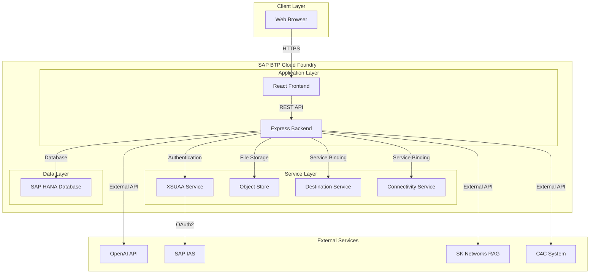
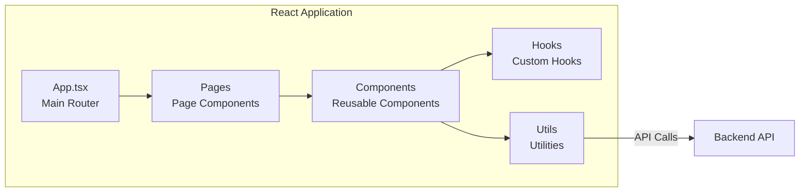
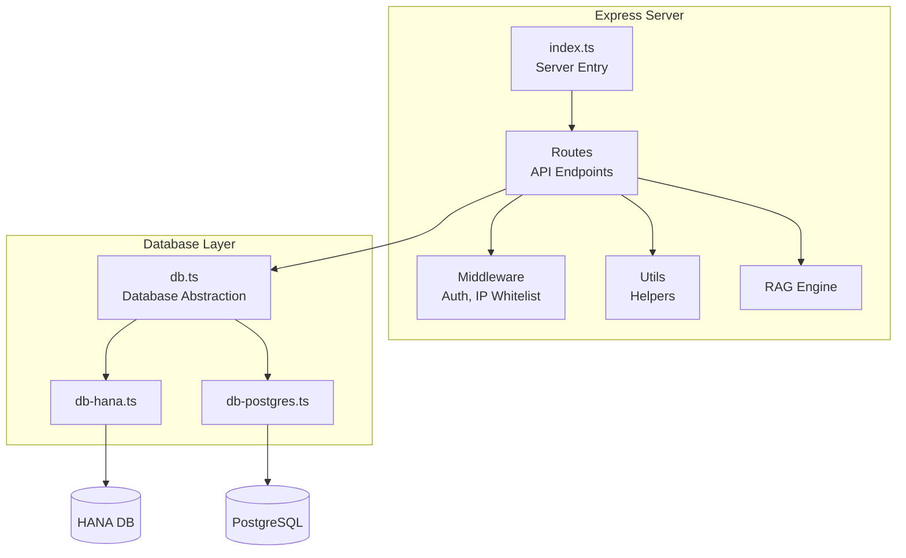
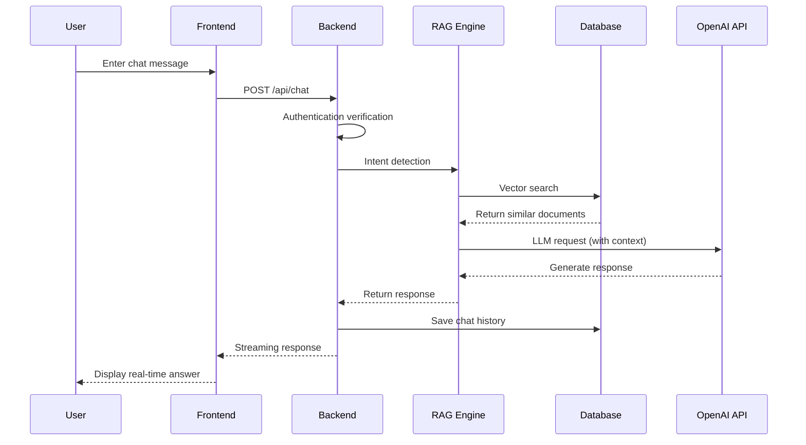
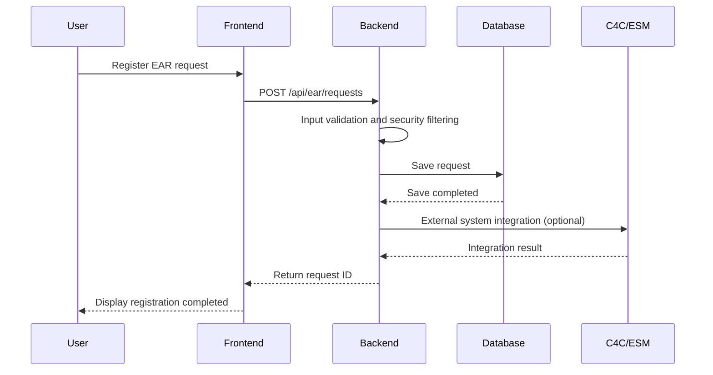
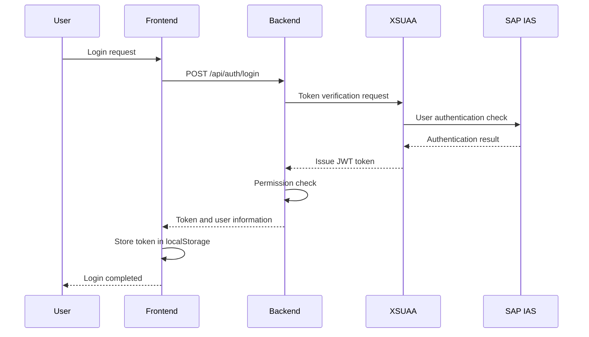
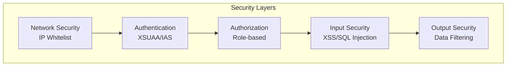
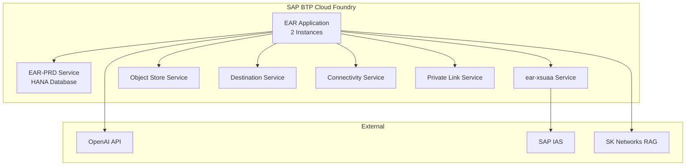
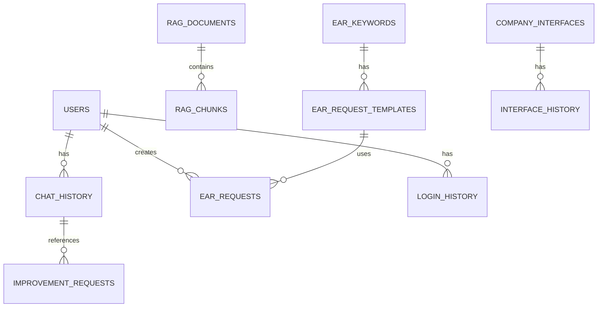
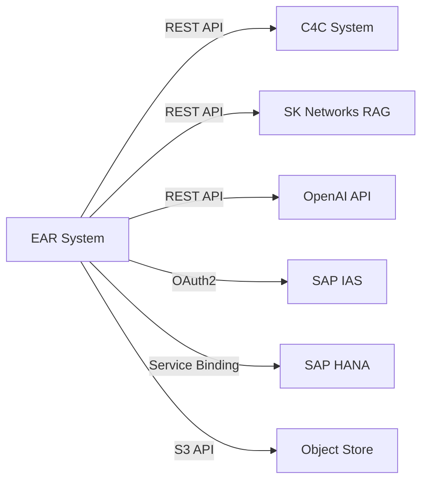

# EAR System Architecture

## 1. System Architecture Overview

The EAR system is based on a 3-Tier architecture and operates in the SAP BTP Cloud Foundry environment.

## 2. Component Architecture

### 2.1 Frontend Architecture

#### Key Components

- **Pages**: Page components for each screen
  - LoginPage, EARRequestRegistration, RAGDocumentManagement, etc.
- **Components**: Reusable UI components
  - ChatPane, HistoryPane, MenuPane, etc.
- **Hooks**: Custom React Hooks
  - useAuth, useFirewallIntent, useMenus
- **Utils**: Utility functions
  - api.ts (API calls), htmlSanitizer.ts (XSS prevention)

### 2.2 Backend Architecture

#### Key Modules

- **Routes**: API endpoint definitions
  - `/api/chat`, `/api/ear`, `/api/rag`, `/api/auth`, etc.
- **Middleware**: Request processing middleware
  - `auth.ts`: JWT/XSUAA authentication
  - `ipWhitelist.ts`: IP whitelist validation
- **RAG Engine**: RAG pipeline processing
  - Document embedding, vector search, LLM response generation

## 3. Data Flow

### 3.1 Chat Request Processing Flow

### 3.2 Request Registration Processing Flow

### 3.3 Authentication and Authorization Flow

## 4. Security Architecture

### Security Layers

1. **Network Security**: Access control through IP whitelist
2. **Authentication**: User authentication through SAP IAS
3. **Authorization**: Role-based access control through XSUAA
4. **Input Security**: Prevention of XSS, SQL Injection, etc.
5. **Output Security**: Filtering and masking of sensitive information

## 5. Deployment Architecture

### Deployment Configuration

- **Application**: 2 instances (high availability)
- **Memory**: 2GB per instance
- **Disk**: 2GB per instance
- **Health Check**: HTTP endpoint (`/health`)

## 6. Database Architecture

### Key Table Groups

1. **User Management**: users, login_history
2. **Chat System**: chat_history, chat_intent_patterns
3. **RAG System**: rag_documents, rag_chunks, rag_agents_info
4. **Request Management**: ear_requests, ear_keywords, ear_request_templates
5. **System Management**: menus, group_menu_mappings, ip_whitelist

## 7. Integration Architecture

### 7.1 External System Integration

### 7.2 Interface Automation

- **Company-specific API Integration**: External API integration through dynamic field mapping
- **Authentication Method Support**: Bearer Token, Basic Auth, etc.
- **Change History Management**: Tracking all interface changes

## 8. Scalability Considerations

### 8.1 Horizontal Scaling

- Utilizing Cloud Foundry's auto-scaling feature
- Traffic distribution through load balancing
- Stateless architecture design

### 8.2 Performance Optimization

- Database index optimization
- Vector search performance tuning
- Caching strategy (Redis can be introduced in the future)

### 8.3 Monitoring

- Health Check endpoint provided
- Log collection and analysis
- Error tracking and alerts

