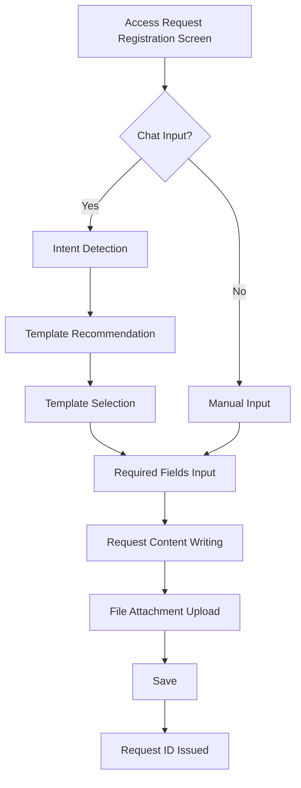
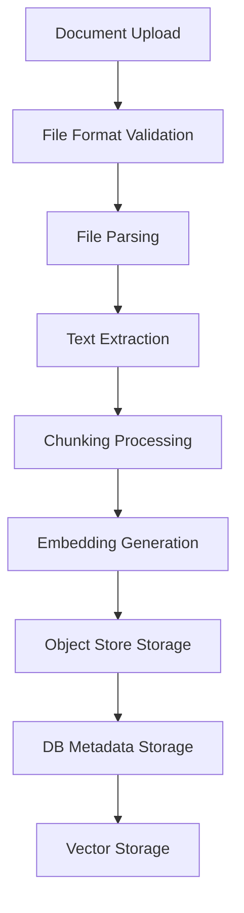
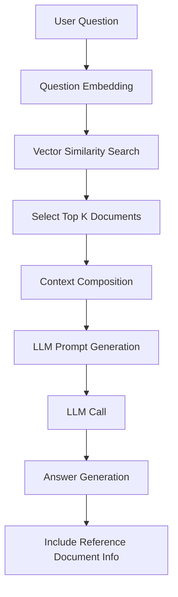
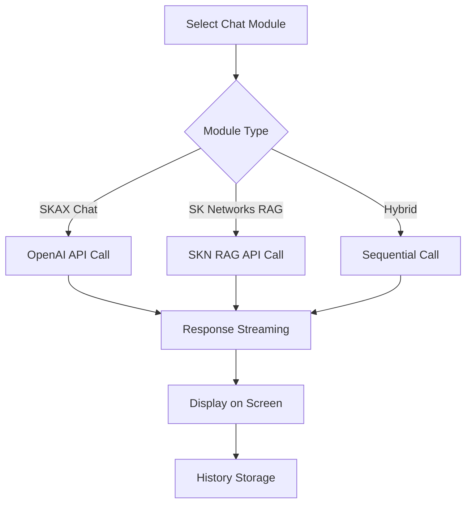
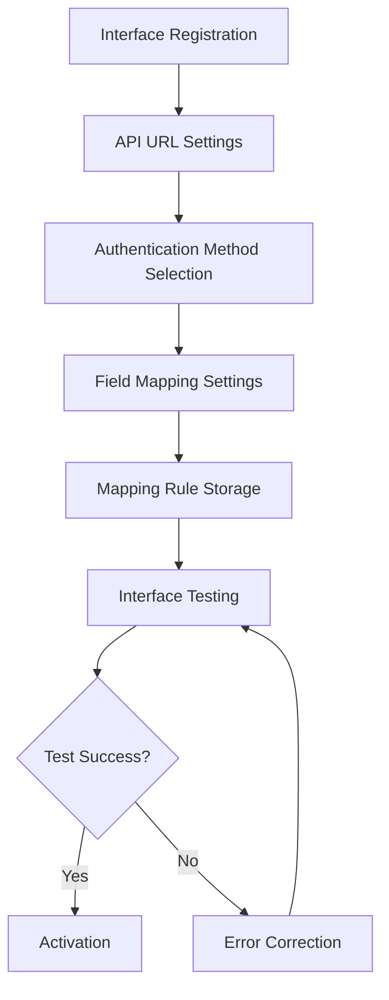

# EAR Functional Specifications

## 1. Feature Overview

The EAR system consists of the following major feature modules:

1. Request Management
2. RAG Management
3. Chat System
4. System Management
5. Process Management

## 2. Request Management Features

### 2.1 EAR Request Registration

**Description**: Function to register ITSM requests, supporting both automatic request generation through chat and manual input methods.

**Key Features**:
- Chat-based request generation
- Request title and content input
- File attachment upload
- Request template selection
- Automatic template recommendation through intent detection

**Input Fields**:
- Request Title (required)
- Request Content (required)
- Template Selection (optional)
- Attachments (optional)

**Processing Flow**:

### 2.2 EAR Request List Inquiry

**Description**: Function to view and filter registered EAR requests.

**Key Features**:
- Request list inquiry (pagination)
- Status filtering (pending, in-progress, completed, rejected)
- Search functionality (title, content)
- Sorting functionality (registration date, update date)
- Detail inquiry

**Inquiry Fields**:
- Request ID
- Request Title
- Status
- Created By
- Created At
- Updated At

### 2.3 ESM Request Registration

**Description**: Function to register requests to the ESM system.

**Key Features**:
- ESM field mapping
- Request data transformation
- ESM API integration
- Integration result confirmation

### 2.4 System Improvement Request

**Description**: Function to request and manage system improvements.

**Key Features**:
- Improvement request registration
- Request status management
- Administrator response functionality
- Request history inquiry

## 3. RAG Management Features

### 3.1 RAG Document Management

**Description**: Function to upload and manage documents for use in the RAG system.

**Key Features**:
- Document upload (TXT, PDF, DOCX, Markdown)
- Document list inquiry
- Document deletion
- Document metadata management
- Object Store integration

**Processing Flow**:

**Supported File Formats**:
- TXT: Text files
- PDF: PDF documents
- DOCX: Microsoft Word documents
- Markdown: Markdown files

### 3.2 RAG Search and Answer Generation

**Description**: Function to generate answers to user questions based on uploaded documents.

**Key Features**:
- Vector similarity search
- Context augmentation
- Answer generation through LLM
- Reference document display

**Processing Flow**:

### 3.3 Answer Quality Improvement Request

**Description**: Function to register requests for improving the quality of RAG system answers.

**Key Features**:
- Answer improvement request registration
- Request category classification
- Administrator review and processing
- Improvement history management

## 4. Chat System Features

### 4.1 Real-time Chat

**Description**: Chat functionality supporting real-time conversation with AI.

**Key Features**:
- Real-time message sending and receiving
- Streaming response support
- Multiple chat module support
- Chat history storage

**Supported Chat Modules**:
1. **SKAX Chat Module**: Basic OpenAI-based chat
2. **SK Networks RAG Module**: SK Networks RAG API integration
3. **SKAX First SKN Second**: Hybrid mode (planned)
4. **SKN First SKAX Second**: Hybrid mode (planned)

**Processing Flow**:

### 4.2 Chat History Management

**Description**: Function to manage chat sessions and history per user.

**Key Features**:
- History inquiry by session
- Session list inquiry
- Session deletion
- User-specific history separation

**Security**:
- User-specific history isolation
- Only authenticated users can access
- Session ID-based access control

### 4.3 Chat Intent Detection

**Description**: Function to detect user intent by analyzing user input and recommend appropriate templates.

**Key Features**:
- Keyword-based intent detection
- Pattern matching
- Template recommendation
- Context-based recommendation

**Intent Pattern Examples**:
- Firewall related: firewall open, firewall change, firewall exception, etc.
- System requests: account creation, permission request, etc.

## 5. System Management Features

### 5.1 User Management

**Description**: Function to manage system users.

**Key Features**:
- User registration/modification/deletion
- User information inquiry
- Permission management (regular user/administrator)
- Account lock/unlock
- Password reset

**User Information Fields**:
- User ID
- Email
- Name
- Department
- Position
- Phone Number
- Employee ID
- Active Status
- Administrator Status

### 5.2 Menu Management

**Description**: Function to manage system menu structure.

**Key Features**:
- Menu registration/modification/deletion
- Menu hierarchy management
- Menu permission settings
- Group-specific menu mapping

**Menu Structure**:
- Primary Menu: Request Management, RAG Management, System Management, Process Management
- Secondary Menu: Detailed menus under each primary menu

### 5.3 Permission Management

**Description**: Function to manage permissions per user and group.

**Key Features**:
- Role-based access control (RBAC)
- Group-specific menu mapping
- Permission verification
- XSUAA role integration

**Permission Levels**:
- **EAR-ADMIN**: System administrator permissions
- **EAR-USER**: Regular user permissions

### 5.4 IP Whitelist Management

**Description**: Function to manage IP addresses allowed to access the system.

**Key Features**:
- IP address registration/modification/deletion
- IP range settings
- Activation/deactivation
- Access log recording

### 5.5 Security Settings Management

**Description**: Function to manage input and output security policies.

#### 5.5.1 Input Security Management

**Key Features**:
- Prohibited keyword management
- SQL Injection pattern blocking
- XSS attack prevention
- Input validation rule settings

#### 5.5.2 Output Security Management

**Key Features**:
- Sensitive information masking
- Output filtering rules
- Data masking pattern settings

### 5.6 RAG Agent Management

**Description**: Function to manage external RAG Agent settings.

**Key Features**:
- RAG Agent registration/modification/deletion
- Company-specific Agent settings
- Agent URL and Token management
- Activation/deactivation

**Management Fields**:
- Company Code
- Agent Description
- Agent URL
- Agent Token
- Active Status
- Created By/Updated By
- Created At/Updated At

### 5.7 Prompt Management

**Description**: Function to manage prompts used in the system.

**Key Features**:
- Prompt registration/modification/deletion
- Prompt version management
- Prompt category management

## 6. Process Management Features

### 6.1 Process Visualization

**Description**: Function to visually represent business processes.

**Key Features**:
- Process node creation
- Process flow visualization
- Node connection management
- Process template management

### 6.2 Interface Automation

**Description**: Function to automate interfaces with external systems.

**Key Features**:
- Interface registration/modification/deletion
- API field mapping
- Authentication settings (Bearer Token, Basic Auth)
- Interface testing
- Change history management

**Processing Flow**:

## 7. Common Features

### 7.1 Authentication and Authorization

**Description**: Function responsible for user authentication and permission management.

**Authentication Methods**:
- JWT-based authentication
- XSUAA-based authentication
- SAP IAS integration

**Authorization Methods**:
- Role-based access control (RBAC)
- Menu-specific permission control

### 7.2 Login History Management

**Description**: Function to record and inquire user login history.

**Recorded Fields**:
- User ID
- Login Time
- IP Address
- User Agent
- Login Status (success/failure)
- Failure Reason

### 7.3 Privacy Policy Management

**Description**: Function to manage privacy policy and user consent.

**Key Features**:
- Privacy policy registration/modification
- Version management
- User consent recording
- Consent history inquiry

## 8. Non-Functional Requirements

### 8.1 Performance Requirements

- API response time: Average within 2 seconds
- Chat response time: Average within 5 seconds (including LLM call)
- Concurrent users: Support for 100+ users

### 8.2 Security Requirements

- All communications use HTTPS
- Block access from unauthenticated users
- Input data validation and filtering
- Output data masking

### 8.3 Availability Requirements

- System uptime: 99% or higher
- Failure recovery time: Within 1 hour
- Data backup: Daily automatic backup

### 8.4 Scalability Requirements

- Horizontal scaling support
- Database performance optimization
- Caching strategy applicable

