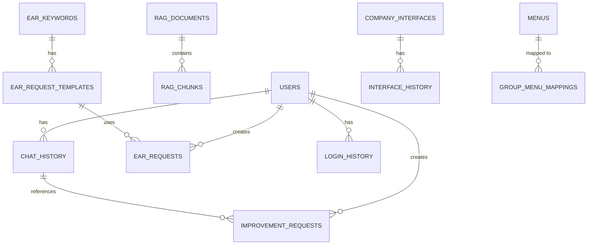

# EAR Database Design Document

## 1. Database Overview

### 1.1 Database Information

| Item | Description |
|------|-------------|
| Database System | SAP HANA Database (Production) / PostgreSQL (Development) |
| Schema Name | EAR |
| Character Encoding | UTF-8 |
| Vector Search | HANA Vector Engine (HANA) / pgvector (PostgreSQL) |

### 1.2 Database Architecture



## 2. Key Table Designs

### 2.1 User Management Tables

#### 2.1.1 users

Table storing user information.

| Column Name | Data Type | Constraints | Description |
|-------------|-----------|-------------|-------------|
| ID | INTEGER | PRIMARY KEY, AUTO_INCREMENT | User ID |
| USERID | NVARCHAR(100) | UNIQUE, NOT NULL | User login ID |
| PASSWORD_HASH | NVARCHAR(255) | NOT NULL | Password hash |
| EMAIL | NVARCHAR(255) | | Email address |
| FULL_NAME | NVARCHAR(200) | | User name |
| DEPARTMENT | NVARCHAR(100) | | Department |
| POSITION | NVARCHAR(100) | | Position |
| PHONE | NVARCHAR(50) | | Phone number |
| EMPLOYEE_ID | NVARCHAR(50) | | Employee ID |
| IS_ACTIVE | BOOLEAN | DEFAULT true | Active status |
| IS_ADMIN | BOOLEAN | DEFAULT false | Administrator status |
| FAILED_LOGIN_ATTEMPTS | INTEGER | DEFAULT 0 | Failed login attempts |
| LOCKED_UNTIL | TIMESTAMP | NULL | Account unlock time |
| LAST_LOGIN | TIMESTAMP | NULL | Last login time |
| PASSWORD_RESET_TOKEN | NVARCHAR(255) | NULL | Password reset token |
| PASSWORD_RESET_EXPIRES | TIMESTAMP | NULL | Token expiration time |
| CREATED_AT | TIMESTAMP | DEFAULT CURRENT_TIMESTAMP | Created at |
| UPDATED_AT | TIMESTAMP | DEFAULT CURRENT_TIMESTAMP | Updated at |

**Indexes**:
- `idx_users_userid`: USERID column
- `idx_users_email`: EMAIL column
- `idx_users_employee_id`: EMPLOYEE_ID column
- `idx_users_is_active`: IS_ACTIVE column
- `idx_users_is_admin`: IS_ADMIN column

#### 2.1.2 login_history

Table storing user login history.

| Column Name | Data Type | Constraints | Description |
|-------------|-----------|-------------|-------------|
| ID | INTEGER | PRIMARY KEY, AUTO_INCREMENT | History ID |
| USER_ID | INTEGER | FOREIGN KEY (users.ID) | User ID |
| USERID | NVARCHAR(100) | NOT NULL | User login ID |
| LOGIN_TIME | TIMESTAMP | DEFAULT CURRENT_TIMESTAMP | Login time |
| IP_ADDRESS | NVARCHAR(45) | | IP address |
| USER_AGENT | NCLOB | | User Agent information |
| LOGIN_STATUS | NVARCHAR(20) | NOT NULL | Login status (success/failure) |
| FAILURE_REASON | NVARCHAR(100) | NULL | Failure reason |

**Indexes**:
- `idx_login_history_user_id`: USER_ID column
- `idx_login_history_userid`: USERID column
- `idx_login_history_login_time`: LOGIN_TIME column
- `idx_login_history_login_status`: LOGIN_STATUS column

### 2.2 Chat System Tables

#### 2.2.1 chat_history

Table storing chat history.

| Column Name | Data Type | Constraints | Description |
|-------------|-----------|-------------|-------------|
| ID | INTEGER | PRIMARY KEY, AUTO_INCREMENT | Chat ID |
| SESSION_ID | NVARCHAR(100) | NOT NULL | Session ID |
| USER_ID | NVARCHAR(100) | | User ID |
| USER_MESSAGE | NCLOB | NOT NULL | User message |
| ASSISTANT_RESPONSE | NCLOB | NOT NULL | Assistant response |
| SOURCES | NCLOB | | Reference document information |
| CREATED_AT | TIMESTAMP | DEFAULT CURRENT_TIMESTAMP | Created at |

**Indexes**:
- `idx_chat_session_id`: SESSION_ID column
- `idx_chat_user_id`: USER_ID column
- `idx_chat_created_at`: CREATED_AT column

### 2.3 RAG System Tables

#### 2.3.1 rag_documents

Table storing RAG document information.

| Column Name | Data Type | Constraints | Description |
|-------------|-----------|-------------|-------------|
| ID | INTEGER | PRIMARY KEY, AUTO_INCREMENT | Document ID |
| NAME | NVARCHAR(500) | NOT NULL | Document name |
| FILE_PATH | NVARCHAR(1000) | | File path (Object Store URL) |
| FILE_TYPE | NVARCHAR(100) | | File type |
| FILE_SIZE | BIGINT | | File size |
| TEXT_CONTENT | NCLOB | | Text content |
| CREATED_AT | TIMESTAMP | DEFAULT CURRENT_TIMESTAMP | Created at |

**Indexes**:
- `idx_rag_documents_name`: NAME column
- `idx_rag_documents_created_at`: CREATED_AT column

#### 2.3.2 rag_chunks

Table storing RAG document chunk information.

| Column Name | Data Type | Constraints | Description |
|-------------|-----------|-------------|-------------|
| ID | INTEGER | PRIMARY KEY, AUTO_INCREMENT | Chunk ID |
| DOCUMENT_ID | INTEGER | FOREIGN KEY (rag_documents.ID) | Document ID |
| CHUNK_INDEX | INTEGER | NOT NULL | Chunk index |
| CONTENT | NCLOB | NOT NULL | Chunk content |
| EMBEDDING | NCLOB | | Embedding vector |
| PAGE_NUMBER | INTEGER | | Page number |
| CREATED_AT | TIMESTAMP | DEFAULT CURRENT_TIMESTAMP | Created at |

**Indexes**:
- `idx_rag_chunks_document_id`: DOCUMENT_ID column

### 2.4 Request Management Tables

#### 2.4.1 ear_requests

Table storing EAR requests.

| Column Name | Data Type | Constraints | Description |
|-------------|-----------|-------------|-------------|
| ID | INTEGER | PRIMARY KEY, AUTO_INCREMENT | Request ID |
| REQUEST_TITLE | NVARCHAR(500) | NOT NULL | Request title |
| REQUEST_CONTENT | NCLOB | NOT NULL | Request content |
| TEMPLATE_ID | INTEGER | FOREIGN KEY (ear_request_templates.ID) | Template ID |
| FORM_DATA | NCLOB | | Form data (JSON) |
| ATTACHMENTS | NCLOB | | Attachment information (JSON) |
| STATUS | NVARCHAR(50) | DEFAULT 'pending' | Status |
| CREATED_BY | NVARCHAR(100) | | Created by |
| CREATED_AT | TIMESTAMP | DEFAULT CURRENT_TIMESTAMP | Created at |
| UPDATED_AT | TIMESTAMP | DEFAULT CURRENT_TIMESTAMP | Updated at |

**Indexes**:
- `idx_ear_requests_status`: STATUS column
- `idx_ear_requests_created_at`: CREATED_AT column

## 3. Database Constraints

### 3.1 Primary Keys

All tables use the ID column as the primary key with AUTO_INCREMENT attribute.

### 3.2 Foreign Keys

Key foreign key relationships:
- `chat_history.USER_ID` → `users.USERID`
- `rag_chunks.DOCUMENT_ID` → `rag_documents.ID`
- `ear_requests.TEMPLATE_ID` → `ear_request_templates.ID`
- `improvement_requests.CHAT_HISTORY_ID` → `chat_history.ID`

### 3.3 Unique Constraints

- `users.USERID`: UNIQUE
- `ear_keywords.KEYWORD`: UNIQUE
- `menus.MENU_CODE`: UNIQUE
- `ear_request_templates(KEYWORD_ID, TEMPLATE_NAME)`: UNIQUE

## 4. Index Strategy

### 4.1 Key Indexes

1. **Query Performance Improvement**: Create indexes on frequently queried columns
2. **Foreign Key Indexes**: Create indexes on all foreign key columns
3. **Composite Indexes**: Create indexes on column combinations frequently queried together

### 4.2 Vector Search Indexes

- PostgreSQL: Use pgvector index
- HANA: Use Vector Engine index

## 5. Data Migration

### 5.1 Migration Files

Migration files are stored in the `server/migrations/` directory.

Key migrations:
- `add_user_id_to_chat_history.sql`: Add user ID to chat history
- `add_company_code.sql`: Add company code column
- `add_esm_fields.sql`: Add ESM fields

### 5.2 Migration Execution

**PostgreSQL**:
```bash
psql -h localhost -U postgres -d ragdb -f server/migrations/[filename].sql
```

**HANA DB**:
```sql
-- Execute in HANA Studio or DBeaver
```

## 6. Data Backup and Recovery

### 6.1 Backup Strategy

- Daily automatic backup
- Weekly full backup
- Change history retention (30 days)

### 6.2 Recovery Procedure

1. Check latest backup file
2. Execute database recovery
3. Verify data integrity
4. Restart application


