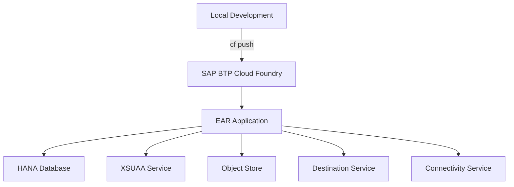

# EAR Deployment Guide

## 1. Deployment Overview

The EAR system is deployed to the SAP BTP (Business Technology Platform) Cloud Foundry environment.

### 1.1 Deployment Environments

| Environment | Description |
|-------------|-------------|
| Development Environment | `ear-dev` application |
| Production Environment | `ear-prd` application |

### 1.2 Deployment Architecture



## 2. Prerequisites

### 2.1 Required Tools

- **Cloud Foundry CLI**: CLI tool for deploying to SAP BTP
- **Node.js**: 18.x or higher
- **npm**: 9.0.0 or higher

### 2.2 SAP BTP Account Setup

1. Access SAP BTP Cockpit
2. Create Subaccount and Space
3. Create required service instances

### 2.3 Service Instance Creation

#### 2.3.1 HANA Database Service

```bash
cf create-service hanatrial hdi-shared EAR-PRD
```

#### 2.3.2 XSUAA Service

```bash
cf create-service xsuaa application ear-xsuaa -c xs-security.json
```

#### 2.3.3 Object Store Service

```bash
cf create-service objectstore s3-standard ear-store
```

## 3. Environment Variables

### 3.1 Required Environment Variables

**Development Environment** (`manifest-dev.yml`):
```yaml
env:
  NODE_ENV: development
  NODE_VERSION: 22.x
  DB_TYPE: hana
  EMBEDDING_MODEL: text-embedding-3-large
  CHAT_MODEL: gpt-4o-mini
  JWT_SECRET: your-super-secret-jwt-key-min-32-chars
  USE_XSUAA: "true"
  DEFAULT_IDP: "sap.custom"
```

**Production Environment** (`manifest-prd.yml`):
```yaml
env:
  NODE_ENV: production
  NODE_VERSION: 22.x
  DB_TYPE: hana
  EMBEDDING_MODEL: text-embedding-3-large
  CHAT_MODEL: gpt-4o-mini
  JWT_SECRET: your-super-secret-jwt-key-min-32-chars
  USE_XSUAA: "true"
  DEFAULT_IDP: "sap.custom"
  SCIM_SCOPE: "openid scim.read"
  IAS_BASE_URL: "https://[ias-tenant].accounts.ondemand.com"
  C4C_BASE_URL: "https://[c4c-instance].crm.cloud.sap"
  SKN_RAG_URL: "https://[skn-rag-url]"
  ADOTBIZ_PRIVATE_LINK_IP: "10.220.5.115"
```

### 3.2 Setting Environment Variables

#### Using Cloud Foundry CLI

```bash
# Development environment
cf set-env ear-dev OPENAI_API_KEY "sk-..."
cf set-env ear-dev JWT_SECRET "your-secret-key"

# Production environment
cf set-env ear-prd OPENAI_API_KEY "sk-..."
cf set-env ear-prd JWT_SECRET "your-secret-key"
```

## 4. Build and Deployment

### 4.1 Local Build

```bash
# Install dependencies
npm install

# Build frontend
cd web
npm install
npm run build
cd ..

# Build backend
cd server
npm install
npm run build
cd ..
```

### 4.2 Cloud Foundry Deployment

#### 4.2.1 Development Environment Deployment

```bash
# Login
cf login -a https://api.cf.[region].hana.ondemand.com

# Select Space
cf target -o [org] -s [space]

# Deploy
cf push -f manifest-dev.yml
```

#### 4.2.2 Production Environment Deployment

```bash
# Login
cf login -a https://api.cf.[region].hana.ondemand.com

# Select Space
cf target -o [org] -s [space]

# Deploy
cf push -f manifest-prd.yml
```

### 4.3 Deployment Verification

```bash
# Check application status
cf apps

# Check logs
cf logs ear-prd --recent

# Health Check
curl https://[app-url]/health
```

## 5. Database Initialization

### 5.1 Schema Creation

Create schema in HANA Database:

```sql
CREATE SCHEMA EAR;
```

### 5.2 Table Creation

Execute `server/schemas-hana.sql` file to create tables:

```bash
# Execute in HANA Studio or DBeaver
# Or connect locally using cf tunnel
```

### 5.3 Initial Data Insertion

```sql
-- Create administrator user
INSERT INTO EAR.users (USERID, PASSWORD_HASH, FULL_NAME, IS_ADMIN, IS_ACTIVE)
VALUES ('admin', '[bcrypt-hash]', 'Administrator', true, true);

-- Basic menu data
-- Execute initializeMenus() function in server/db-hana.ts
```

## 6. XSUAA and IAS Setup

### 6.1 XSUAA Service Instance Creation

```bash
cf create-service xsuaa application ear-xsuaa -c xs-security.json
```

### 6.2 xs-security.json Configuration

```json
{
  "xsappname": "ear",
  "tenant-mode": "dedicated",
  "scopes": [
    {
      "name": "$XSAPPNAME.Admin",
      "description": "Admin scope"
    },
    {
      "name": "$XSAPPNAME.User",
      "description": "User scope"
    }
  ],
  "role-templates": [
    {
      "name": "EAR-ADMIN",
      "description": "EAR Administrator",
      "scope-references": ["$XSAPPNAME.Admin"]
    },
    {
      "name": "EAR-USER",
      "description": "EAR User",
      "scope-references": ["$XSAPPNAME.User"]
    }
  ]
}
```

### 6.3 SAP IAS Setup

1. Access SAP IAS Tenant
2. Register application
3. OAuth2 configuration
4. Trust setup with XSUAA

Refer to `prompt/README-XSUAA-IAS-설정가이드.md` for details

## 7. Post-Deployment Verification

### 7.1 Application Status

- [ ] Verify application started successfully
- [ ] Verify Health Check endpoint response
- [ ] Verify no errors in logs

### 7.2 Database Connection

- [ ] Verify database connection success
- [ ] Verify table creation
- [ ] Verify initial data insertion

### 7.3 Authentication and Authorization

- [ ] Verify login functionality
- [ ] Verify XSUAA authentication
- [ ] Verify menu access by permission

### 7.4 Feature Testing

- [ ] Test chat functionality
- [ ] Test request registration functionality
- [ ] Test document upload functionality
- [ ] Test RAG search functionality

## 8. Rollback Procedure

### 8.1 Rollback to Previous Version

```bash
# Check previous versions
cf revisions ear-prd

# Rollback to specific version
cf rollback ear-prd [revision-number]
```

## 9. Monitoring and Logs

### 9.1 Log Viewing

```bash
# Real-time logs
cf logs ear-prd

# Recent logs
cf logs ear-prd --recent

# Logs for specific time period
cf logs ear-prd --recent | grep "2025-01-01"
```

### 9.2 Application Metrics

```bash
# Application status
cf app ear-prd

# Instance status
cf app ear-prd --guid | xargs cf curl /v2/apps/$(cf app ear-prd --guid)/stats
```

## 10. Troubleshooting

### 10.1 Common Issues

#### Application Startup Failure

```bash
# Check logs
cf logs ear-prd --recent

# Check environment variables
cf env ear-prd

# Check service bindings
cf services
```

#### Database Connection Failure

- Verify service instance is created
- Verify service binding
- Verify `DB_TYPE` environment variable is correct

#### Authentication Failure

- Verify XSUAA service instance
- Verify xs-security.json configuration
- Verify IAS Trust setup

## 11. Deployment Checklist

### 11.1 Pre-Deployment

- [ ] Verify code build success
- [ ] Complete local testing
- [ ] Verify environment variable settings
- [ ] Verify service instance creation
- [ ] Prepare database schema

### 11.2 During Deployment

- [ ] Monitor build process
- [ ] Check deployment logs
- [ ] Stop immediately if errors occur

### 11.3 Post-Deployment

- [ ] Verify application status
- [ ] Verify Health Check
- [ ] Perform feature testing
- [ ] Monitor logs
- [ ] Verify performance


