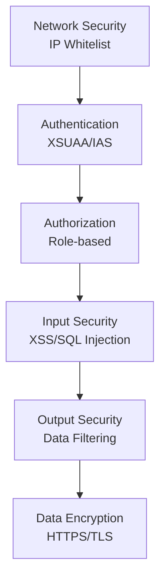

# EAR Security Guide

## 1. Security Overview

The EAR system protects data and systems through a multi-layered security architecture.

### 1.1 Security Layers

## 2. Authentication and Authorization

### 2.1 Authentication Methods

#### 2.1.1 JWT-Based Authentication

- **Token Issuance**: JWT token issued upon login
- **Token Verification**: Token verified on all API requests
- **Token Expiration**: Automatic expiration after set time

#### 2.1.2 XSUAA-Based Authentication

- **SAP BTP Integration**: Authentication through XSUAA service
- **IAS Integration**: Integration with SAP Identity Authentication Service
- **OAuth2 Protocol**: Uses standard OAuth2 protocol

### 2.2 Authorization (Permission Management)

#### 2.2.1 Role-Based Access Control (RBAC)

**Permission Levels**:
- **EAR-ADMIN**: System administrator permissions
  - Access to all features
  - User management
  - System settings management
- **EAR-USER**: Regular user permissions
  - Access to basic features
  - View/modify own data only

## 3. Network Security

### 3.1 IP Whitelist

**Function**: Only allowed IP addresses can access the system

**Configuration Method**:
1. Access System Management > IP Whitelist Management menu
2. Register IP address
3. Activation settings

**Limitations**:
- Can set IP address or IP range
- Toggle activation/deactivation
- Access log recording

### 3.2 HTTPS/TLS

- All communications use HTTPS
- Use TLS 1.2 or higher
- Certificate verification

## 4. Input Security

### 4.1 XSS (Cross-Site Scripting) Prevention

**Countermeasures**:
- Input data validation and filtering
- HTML tag escaping
- Use DOMPurify library

**Implementation Location**:
- `server/utils/inputValidation.ts`
- `web/src/utils/htmlSanitizer.ts`

### 4.2 SQL Injection Prevention

**Countermeasures**:
- Use parameterized queries
- Use ORM (minimize direct SQL)
- Input data validation

**Implementation Location**:
- `server/db.ts`: All queries are parameterized
- `server/utils/inputValidation.ts`: Input validation

### 4.3 Input Validation Rules

**Management Function**: System Management > Input Security Management

**Validation Items**:
- Prohibited keyword list
- SQL Injection patterns
- XSS patterns
- Special character filtering

## 5. Output Security

### 5.1 Sensitive Information Masking

**Masking Targets**:
- Email addresses
- Phone numbers
- Social Security Numbers (future)
- Account numbers (future)

**Masking Rules**:
- Email: `user***@domain.com`
- Phone: `010-****-1234`

### 5.2 Output Filtering

**Management Function**: System Management > Output Security Management

**Filtering Rules**:
- Sensitive information pattern detection
- Automatic masking application
- User-specific filtering rules

## 6. Data Security

### 6.1 Password Security

**Storage Method**:
- bcrypt hashing (salt rounds: 10)
- Plain text password storage prohibited

**Policy**:
- Minimum length: 8 characters
- Complexity requirements (future implementation)
- Password expiration policy (future implementation)

### 6.2 Data Encryption

**Encryption in Transit**:
- Use HTTPS/TLS
- All API communications encrypted

**Encryption at Rest**:
- Database-level encryption (HANA)
- Additional encryption for sensitive information (future implementation)

### 6.3 Data Access Control

**User-Specific Data Isolation**:
- Chat history: Separated by user
- Request data: Limited to creator
- Login history: Viewable by user

## 7. Session Management

### 7.1 Session Timeout

- JWT token expiration time setting
- Automatic logout functionality
- Session refresh functionality

### 7.2 Account Locking

**Lock Conditions**:
- Failed login attempts: 5 times
- Lock duration: 30 minutes

**Unlock Method**:
- Administrator manual unlock
- Automatic unlock after lock duration expires

## 8. Logging and Monitoring

### 8.1 Security Logs

**Recorded Items**:
- Login attempts (success/failure)
- IP address
- User Agent
- Failure reason
- Access attempts

### 8.2 Anomaly Detection

**Detection Items**:
- Repeated login failures
- Abnormal API call patterns
- Unauthorized access attempts

## 9. External API Security

### 9.1 API Key Management

**Management Method**:
- Stored in environment variables
- Use service binding (BTP)
- RAG Agent information encrypted in DB (future)

### 9.2 External API Call Security

**Security Measures**:
- Use HTTPS
- Authentication token verification
- Request timeout settings
- Error handling and logging

## 10. File Upload Security

### 10.1 File Validation

**Validation Items**:
- File extension validation
- MIME type validation
- File size limit (100MB)
- Virus scanning (future implementation)

### 10.2 File Storage

**Storage Location**:
- SAP BTP Object Store
- File paths stored in DB
- Direct file system access not allowed

### 10.3 File Download Security

- Only authenticated users can download
- File access permission verification
- Download log recording

## 11. Security Best Practices

### 11.1 Development Considerations

1. **Input Validation**: Validate all user inputs
2. **Output Encoding**: Encode all output data
3. **Error Messages**: Do not expose detailed error information
4. **Log Management**: Do not log sensitive information
5. **Dependency Management**: Do not use packages with security vulnerabilities

### 11.2 Operational Considerations

1. **Regular Updates**: Apply security patches regularly
2. **Log Monitoring**: Check for anomalies regularly
3. **Access Permission Review**: Review user permissions regularly
4. **Backup Management**: Regular backup and recovery testing
5. **Certificate Management**: Manage SSL certificate expiration

## 12. Security Checklist

### 12.1 Regular Check Items

- [ ] User permission review
- [ ] IP whitelist review
- [ ] Security log review
- [ ] Password policy compliance check
- [ ] SSL certificate validity check
- [ ] Dependency security vulnerability check
- [ ] Backup status check

### 12.2 Pre-Deployment Check

- [ ] Security check of environment variables
- [ ] Check for API key exposure
- [ ] Database access permission check
- [ ] Network security settings check
- [ ] Logging settings check

## 13. Security Incident Response

### 13.1 Incident Response Procedure

1. **Incident Discovery**: Detect anomalies
2. **Immediate Action**: Minimize impact scope
3. **Root Cause Analysis**: Analyze logs and identify cause
4. **Recovery Action**: System recovery and security enhancement
5. **Post-Action**: Establish recurrence prevention measures

