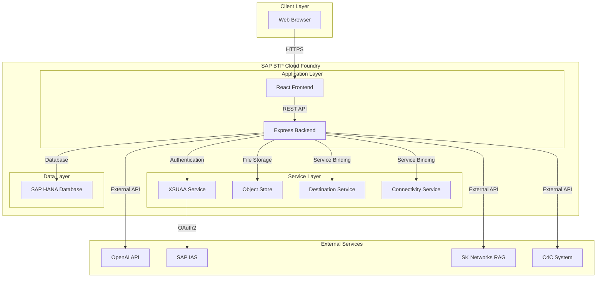
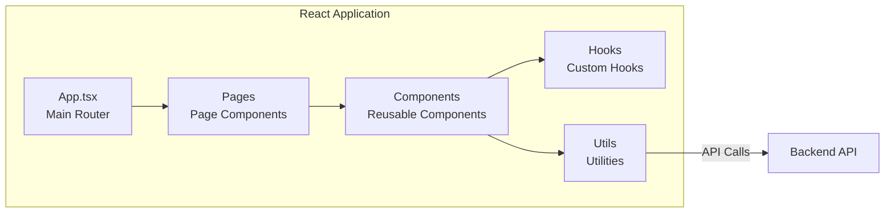
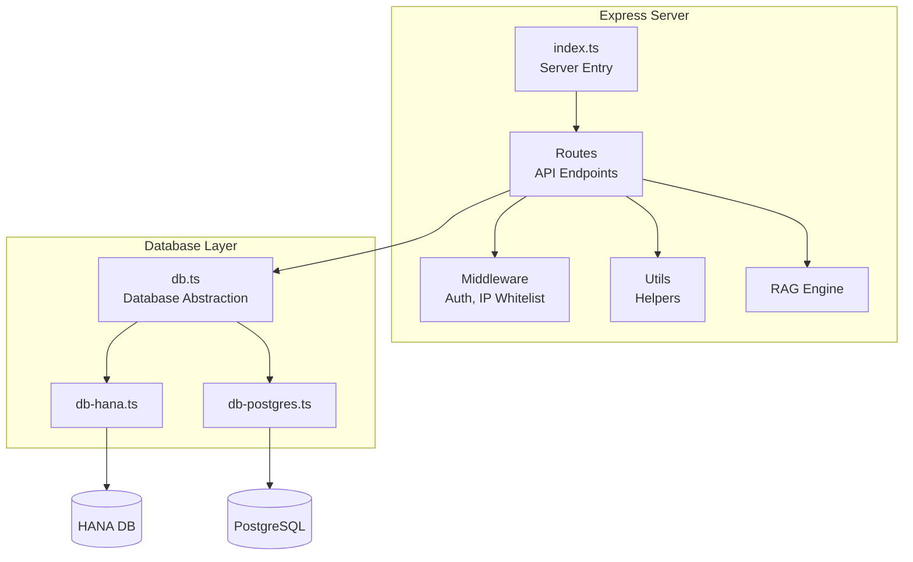
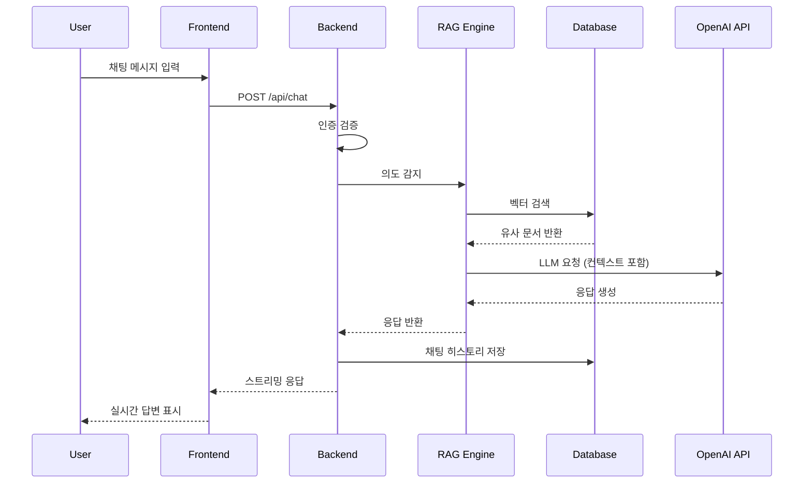
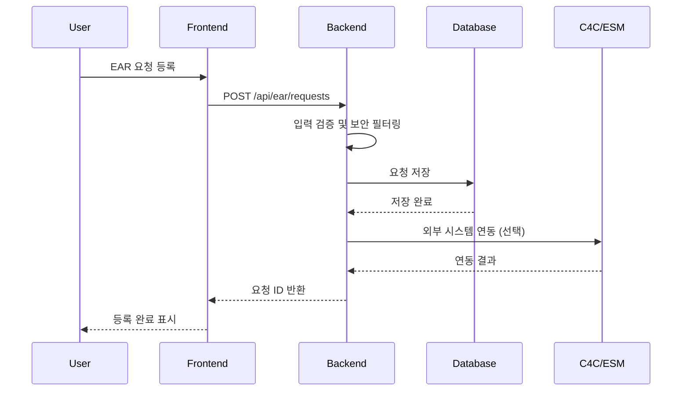
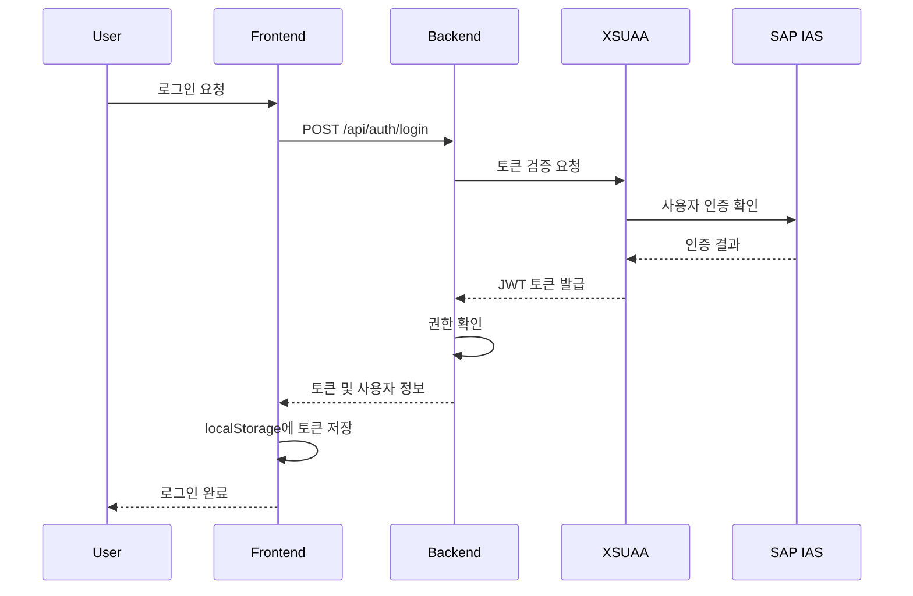
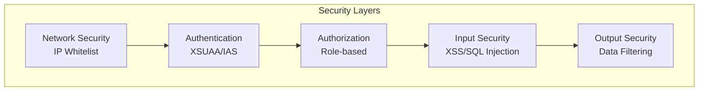
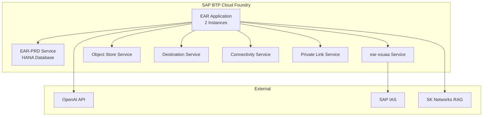
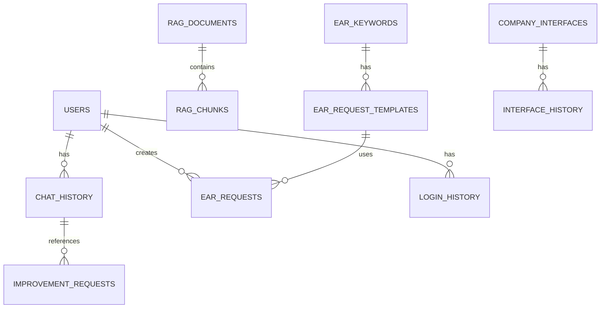
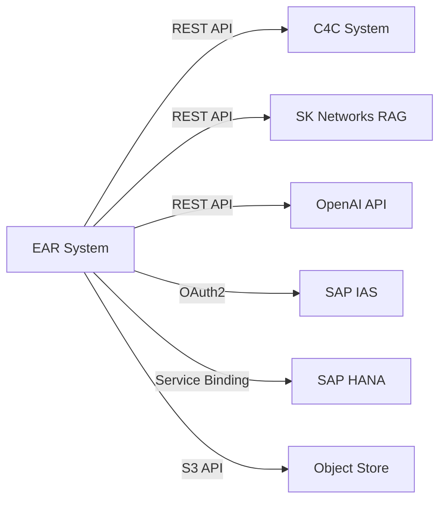

# EAR 시스템 아키텍처

## 1. 시스템 아키텍처 개요

EAR 시스템은 3-Tier 아키텍처를 기반으로 하며, SAP BTP Cloud Foundry 환경에서 운영됩니다.

## 2. 컴포넌트 아키텍처

### 2.1 Frontend 아키텍처

#### 주요 컴포넌트

- **Pages**: 각 화면별 페이지 컴포넌트
  - LoginPage, EARRequestRegistration, RAGDocumentManagement 등
- **Components**: 재사용 가능한 UI 컴포넌트
  - ChatPane, HistoryPane, MenuPane 등
- **Hooks**: 커스텀 React Hooks
  - useAuth, useFirewallIntent, useMenus
- **Utils**: 유틸리티 함수
  - api.ts (API 호출), htmlSanitizer.ts (XSS 방지)

### 2.2 Backend 아키텍처

#### 주요 모듈

- **Routes**: API 엔드포인트 정의
  - `/api/chat`, `/api/ear`, `/api/rag`, `/api/auth` 등
- **Middleware**: 요청 처리 미들웨어
  - `auth.ts`: JWT/XSUAA 인증
  - `ipWhitelist.ts`: IP 화이트리스트 검증
- **RAG Engine**: RAG 파이프라인 처리
  - 문서 임베딩, 벡터 검색, LLM 응답 생성

## 3. 데이터 흐름

### 3.1 채팅 요청 처리 흐름

### 3.2 요청 등록 처리 흐름

### 3.3 인증 및 권한 처리 흐름

## 4. 보안 아키텍처

### 보안 계층

1. **네트워크 보안**: IP 화이트리스트를 통한 접근 제어
2. **인증**: SAP IAS를 통한 사용자 인증
3. **권한 관리**: XSUAA를 통한 역할 기반 접근 제어
4. **입력 보안**: XSS, SQL Injection 등 공격 방지
5. **출력 보안**: 민감 정보 필터링 및 마스킹

## 5. 배포 아키텍처

### 배포 구성

- **애플리케이션**: 2개 인스턴스 (고가용성)
- **메모리**: 2GB per instance
- **디스크**: 2GB per instance
- **Health Check**: HTTP endpoint (`/health`)

## 6. 데이터베이스 아키텍처

### 주요 테이블 그룹

1. **사용자 관리**: users, login_history
2. **채팅 시스템**: chat_history, chat_intent_patterns
3. **RAG 시스템**: rag_documents, rag_chunks, rag_agents_info
4. **요청 관리**: ear_requests, ear_keywords, ear_request_templates
5. **시스템 관리**: menus, group_menu_mappings, ip_whitelist

## 7. 통합 아키텍처

### 7.1 외부 시스템 연동

### 7.2 인터페이스 자동화

- **회사별 API 연동**: 동적 필드 매핑을 통한 외부 API 연동
- **인증 방식 지원**: Bearer Token, Basic Auth 등
- **변경 이력 관리**: 모든 인터페이스 변경사항 추적

## 8. 확장성 고려사항

### 8.1 수평 확장

- Cloud Foundry의 자동 스케일링 기능 활용
- 로드 밸런싱을 통한 트래픽 분산
- 상태 비저장(Stateless) 아키텍처 설계

### 8.2 성능 최적화

- 데이터베이스 인덱스 최적화
- 벡터 검색 성능 튜닝
- 캐싱 전략 (향후 Redis 도입 가능)

### 8.3 모니터링

- Health Check 엔드포인트 제공
- 로그 수집 및 분석
- 에러 추적 및 알림

