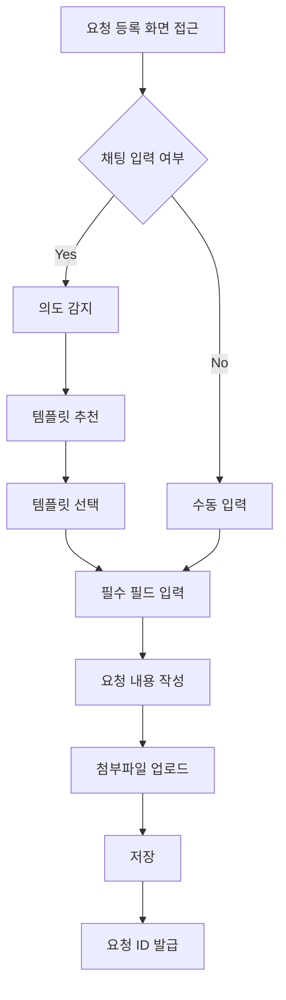
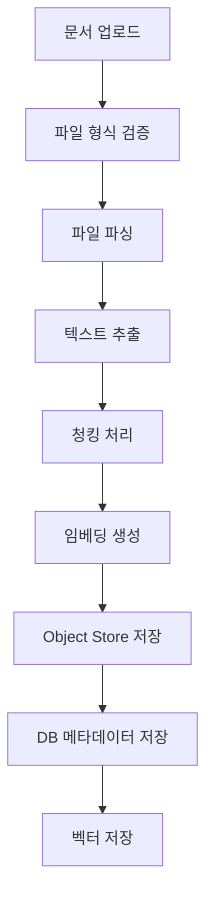
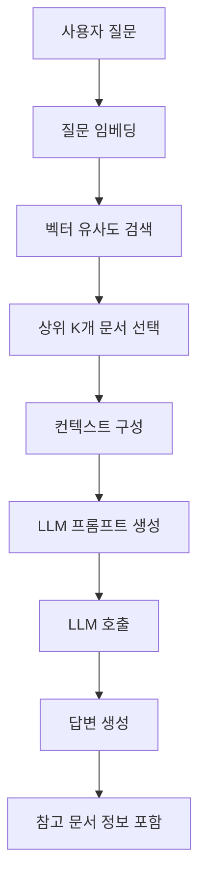
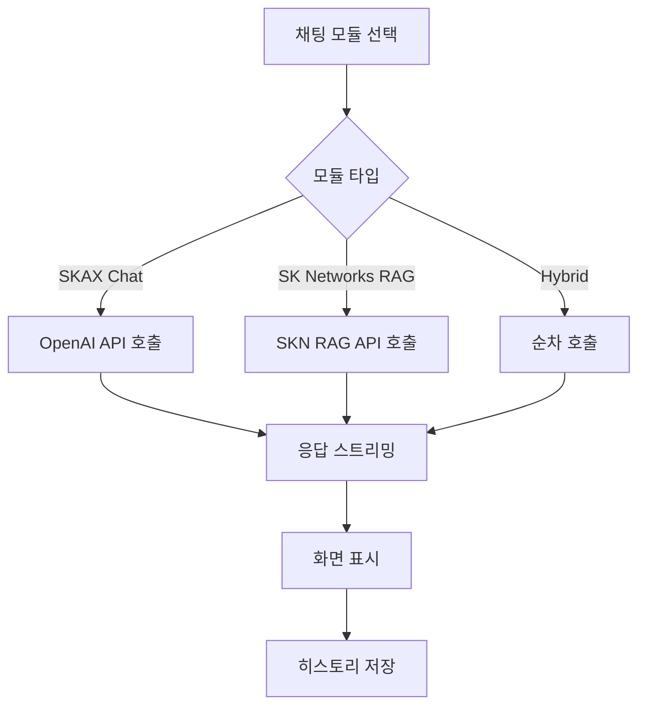
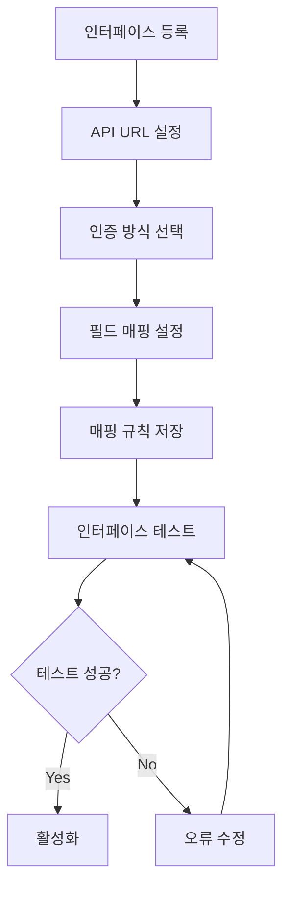

# EAR 기능 명세서

## 1. 기능 개요

EAR 시스템은 다음과 같은 주요 기능 모듈로 구성됩니다:

1. 요청 관리
2. RAG 관리
3. 채팅 시스템
4. 시스템 관리
5. 프로세스 관리

## 2. 요청 관리 기능

### 2.1 EAR 요청 등록

**기능 설명**: ITSM 요청을 등록하는 기능으로, 채팅을 통한 자동 요청 생성과 수동 입력 방식을 모두 지원합니다.

**주요 기능**:
- 채팅 기반 요청 생성
- 요청 제목 및 내용 입력
- 첨부파일 업로드
- 요청 템플릿 선택
- 의도 감지를 통한 템플릿 자동 추천

**입력 항목**:
- 요청 제목 (필수)
- 요청 내용 (필수)
- 템플릿 선택 (선택)
- 첨부파일 (선택)

**처리 흐름**:

### 2.2 EAR 요청 목록 조회

**기능 설명**: 등록된 EAR 요청을 조회하고 필터링하는 기능입니다.

**주요 기능**:
- 요청 목록 조회 (페이지네이션)
- 상태별 필터링 (pending, in-progress, completed, rejected)
- 검색 기능 (제목, 내용)
- 정렬 기능 (등록일시, 수정일시)
- 상세 조회

**조회 항목**:
- 요청 ID
- 요청 제목
- 상태
- 등록자
- 등록일시
- 수정일시

### 2.3 ESM 요청 등록

**기능 설명**: ESM 시스템으로의 요청을 등록하는 기능입니다.

**주요 기능**:
- ESM 필드 매핑
- 요청 데이터 변환
- ESM API 연동
- 연동 결과 확인

### 2.4 시스템 개선 요청

**기능 설명**: 시스템 개선사항을 요청하고 관리하는 기능입니다.

**주요 기능**:
- 개선 요청 등록
- 요청 상태 관리
- 관리자 응답 기능
- 요청 이력 조회

## 3. RAG 관리 기능

### 3.1 RAG 문서 관리

**기능 설명**: RAG 시스템에서 사용할 문서를 업로드하고 관리하는 기능입니다.

**주요 기능**:
- 문서 업로드 (TXT, PDF, DOCX, Markdown)
- 문서 목록 조회
- 문서 삭제
- 문서 메타데이터 관리
- Object Store 연동

**처리 흐름**:

**지원 파일 형식**:
- TXT: 텍스트 파일
- PDF: PDF 문서
- DOCX: Microsoft Word 문서
- Markdown: 마크다운 파일

### 3.2 RAG 검색 및 답변 생성

**기능 설명**: 업로드된 문서를 기반으로 사용자 질문에 대한 답변을 생성하는 기능입니다.

**주요 기능**:
- 벡터 유사도 검색
- 컨텍스트 증강
- LLM을 통한 답변 생성
- 참고 문서 표시

**처리 흐름**:

### 3.3 답변 품질 개선 요청

**기능 설명**: RAG 시스템의 답변 품질을 개선하기 위한 요청을 등록하는 기능입니다.

**주요 기능**:
- 답변 개선 요청 등록
- 요청 카테고리 분류
- 관리자 검토 및 처리
- 개선 이력 관리

## 4. 채팅 시스템 기능

### 4.1 실시간 채팅

**기능 설명**: AI와의 실시간 대화를 지원하는 채팅 기능입니다.

**주요 기능**:
- 실시간 메시지 전송 및 수신
- 스트리밍 응답 지원
- 다중 채팅 모듈 지원
- 채팅 히스토리 저장

**지원 채팅 모듈**:
1. **SKAX Chat Module**: 기본 OpenAI 기반 채팅
2. **SK Networks RAG Module**: SK Networks RAG API 연동
3. **SKAX First SKN Second**: 하이브리드 모드 (구현 예정)
4. **SKN First SKAX Second**: 하이브리드 모드 (구현 예정)

**처리 흐름**:

### 4.2 채팅 히스토리 관리

**기능 설명**: 사용자별 채팅 세션 및 히스토리를 관리하는 기능입니다.

**주요 기능**:
- 세션별 히스토리 조회
- 세션 목록 조회
- 세션 삭제
- 사용자별 히스토리 분리

**보안**:
- 사용자별 히스토리 격리
- 인증된 사용자만 접근 가능
- 세션 ID 기반 접근 제어

### 4.3 채팅 의도 감지

**기능 설명**: 사용자 입력을 분석하여 의도를 감지하고 적절한 템플릿을 추천하는 기능입니다.

**주요 기능**:
- 키워드 기반 의도 감지
- 패턴 매칭
- 템플릿 추천
- 컨텍스트 기반 추천

**의도 패턴 예시**:
- 방화벽 관련: 방화벽 오픈, 방화벽 변경, 방화벽 예외 등
- 시스템 요청: 계정 생성, 권한 요청 등

## 5. 시스템 관리 기능

### 5.1 사용자 관리

**기능 설명**: 시스템 사용자를 관리하는 기능입니다.

**주요 기능**:
- 사용자 등록/수정/삭제
- 사용자 정보 조회
- 권한 관리 (일반 사용자/관리자)
- 계정 잠금/해제
- 비밀번호 초기화

**사용자 정보 항목**:
- 사용자 ID
- 이메일
- 이름
- 부서
- 직책
- 전화번호
- 사원번호
- 활성화 여부
- 관리자 여부

### 5.2 메뉴 관리

**기능 설명**: 시스템 메뉴 구조를 관리하는 기능입니다.

**주요 기능**:
- 메뉴 등록/수정/삭제
- 메뉴 계층 구조 관리
- 메뉴 권한 설정
- 그룹별 메뉴 매핑

**메뉴 구조**:
- 1차 메뉴: 요청관리, RAG 관리, 시스템 관리, 프로세스 관리
- 2차 메뉴: 각 1차 메뉴 하위의 세부 메뉴

### 5.3 권한 관리

**기능 설명**: 사용자 및 그룹별 권한을 관리하는 기능입니다.

**주요 기능**:
- 역할 기반 접근 제어 (RBAC)
- 그룹별 메뉴 매핑
- 권한 검증
- XSUAA 역할 연동

**권한 레벨**:
- **EAR-ADMIN**: 시스템 관리자 권한
- **EAR-USER**: 일반 사용자 권한

### 5.4 IP 화이트리스트 관리

**기능 설명**: 시스템 접근을 허용할 IP 주소를 관리하는 기능입니다.

**주요 기능**:
- IP 주소 등록/수정/삭제
- IP 범위 설정
- 활성화/비활성화
- 접근 로그 기록

### 5.5 보안 설정 관리

**기능 설명**: 입력 및 출력 보안 정책을 관리하는 기능입니다.

#### 5.5.1 입력 보안 관리

**주요 기능**:
- 금지 키워드 관리
- SQL Injection 패턴 차단
- XSS 공격 방지
- 입력 검증 규칙 설정

#### 5.5.2 출력 보안 관리

**주요 기능**:
- 민감 정보 마스킹
- 출력 필터링 규칙
- 데이터 마스킹 패턴 설정

### 5.6 RAG Agent 관리

**기능 설명**: 외부 RAG Agent 설정을 관리하는 기능입니다.

**주요 기능**:
- RAG Agent 등록/수정/삭제
- 회사별 Agent 설정
- Agent URL 및 Token 관리
- 활성화/비활성화

**관리 항목**:
- 회사 구분 코드
- Agent 설명
- Agent URL
- Agent Token
- 사용 여부
- 등록자/수정자
- 등록일시/수정일시

### 5.7 프롬프트 관리

**기능 설명**: 시스템에서 사용하는 프롬프트를 관리하는 기능입니다.

**주요 기능**:
- 프롬프트 등록/수정/삭제
- 프롬프트 버전 관리
- 프롬프트 카테고리 관리

## 6. 프로세스 관리 기능

### 6.1 프로세스 시각화

**기능 설명**: 비즈니스 프로세스를 시각적으로 표현하는 기능입니다.

**주요 기능**:
- 프로세스 노드 생성
- 프로세스 플로우 시각화
- 노드 간 연결 관리
- 프로세스 템플릿 관리

### 6.2 인터페이스 자동화

**기능 설명**: 외부 시스템과의 인터페이스를 자동화하는 기능입니다.

**주요 기능**:
- 인터페이스 등록/수정/삭제
- API 필드 매핑
- 인증 설정 (Bearer Token, Basic Auth)
- 인터페이스 테스트
- 변경 이력 관리

**처리 흐름**:

## 7. 공통 기능

### 7.1 인증 및 인가

**기능 설명**: 사용자 인증 및 권한 관리를 담당하는 기능입니다.

**인증 방식**:
- JWT 기반 인증
- XSUAA 기반 인증
- SAP IAS 연동

**인가 방식**:
- 역할 기반 접근 제어 (RBAC)
- 메뉴별 권한 제어

### 7.2 로그인 이력 관리

**기능 설명**: 사용자 로그인 이력을 기록하고 조회하는 기능입니다.

**기록 항목**:
- 사용자 ID
- 로그인 시간
- IP 주소
- User Agent
- 로그인 상태 (성공/실패)
- 실패 사유

### 7.3 개인정보 처리방침 관리

**기능 설명**: 개인정보 처리방침을 관리하고 사용자 동의를 관리하는 기능입니다.

**주요 기능**:
- 개인정보 처리방침 등록/수정
- 버전 관리
- 사용자 동의 기록
- 동의 이력 조회

## 8. 비기능 요구사항

### 8.1 성능 요구사항

- API 응답 시간: 평균 2초 이내
- 채팅 응답 시간: 평균 5초 이내 (LLM 호출 포함)
- 동시 사용자: 100명 이상 지원

### 8.2 보안 요구사항

- 모든 통신은 HTTPS 사용
- 인증되지 않은 사용자 접근 차단
- 입력 데이터 검증 및 필터링
- 출력 데이터 마스킹

### 8.3 가용성 요구사항

- 시스템 가동률: 99% 이상
- 장애 복구 시간: 1시간 이내
- 데이터 백업: 일일 자동 백업

### 8.4 확장성 요구사항

- 수평 확장 지원
- 데이터베이스 성능 최적화
- 캐싱 전략 적용 가능
