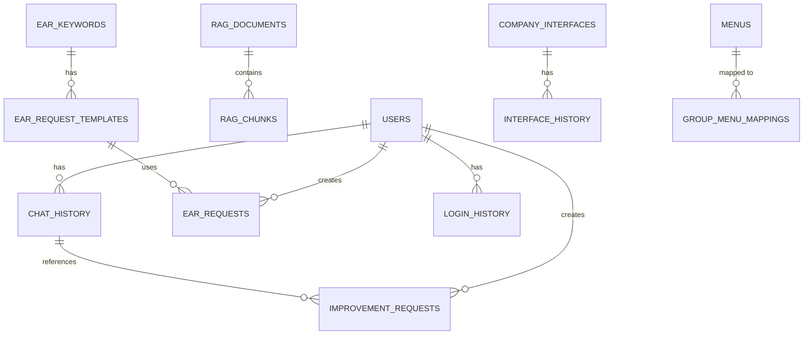

# EAR 데이터베이스 설계서

## 1. 데이터베이스 개요

### 1.1 데이터베이스 정보

| 항목 | 내용 |
|------|------|
| 데이터베이스 시스템 | SAP HANA Database (운영) / PostgreSQL (개발) |
| 스키마명 | EAR |
| 문자 인코딩 | UTF-8 |
| 벡터 검색 | HANA Vector Engine (HANA) / pgvector (PostgreSQL) |

### 1.2 데이터베이스 아키텍처



## 2. 주요 테이블 설계

### 2.1 사용자 관리 테이블

#### 2.1.1 users

사용자 정보를 저장하는 테이블입니다.

| 컬럼명 | 데이터 타입 | 제약조건 | 설명 |
|--------|------------|---------|------|
| ID | INTEGER | PRIMARY KEY, AUTO_INCREMENT | 사용자 ID |
| USERID | NVARCHAR(100) | UNIQUE, NOT NULL | 사용자 로그인 ID |
| PASSWORD_HASH | NVARCHAR(255) | NOT NULL | 비밀번호 해시 |
| EMAIL | NVARCHAR(255) | | 이메일 주소 |
| FULL_NAME | NVARCHAR(200) | | 사용자 이름 |
| DEPARTMENT | NVARCHAR(100) | | 부서 |
| POSITION | NVARCHAR(100) | | 직책 |
| PHONE | NVARCHAR(50) | | 전화번호 |
| EMPLOYEE_ID | NVARCHAR(50) | | 사원번호 |
| IS_ACTIVE | BOOLEAN | DEFAULT true | 활성화 여부 |
| IS_ADMIN | BOOLEAN | DEFAULT false | 관리자 여부 |
| FAILED_LOGIN_ATTEMPTS | INTEGER | DEFAULT 0 | 로그인 실패 횟수 |
| LOCKED_UNTIL | TIMESTAMP | NULL | 계정 잠금 해제 시간 |
| LAST_LOGIN | TIMESTAMP | NULL | 마지막 로그인 시간 |
| PASSWORD_RESET_TOKEN | NVARCHAR(255) | NULL | 비밀번호 재설정 토큰 |
| PASSWORD_RESET_EXPIRES | TIMESTAMP | NULL | 토큰 만료 시간 |
| CREATED_AT | TIMESTAMP | DEFAULT CURRENT_TIMESTAMP | 등록일시 |
| UPDATED_AT | TIMESTAMP | DEFAULT CURRENT_TIMESTAMP | 수정일시 |

**인덱스**:
- `idx_users_userid`: USERID 컬럼
- `idx_users_email`: EMAIL 컬럼
- `idx_users_employee_id`: EMPLOYEE_ID 컬럼
- `idx_users_is_active`: IS_ACTIVE 컬럼
- `idx_users_is_admin`: IS_ADMIN 컬럼

#### 2.1.2 login_history

사용자 로그인 이력을 저장하는 테이블입니다.

| 컬럼명 | 데이터 타입 | 제약조건 | 설명 |
|--------|------------|---------|------|
| ID | INTEGER | PRIMARY KEY, AUTO_INCREMENT | 이력 ID |
| USER_ID | INTEGER | FOREIGN KEY (users.ID) | 사용자 ID |
| USERID | NVARCHAR(100) | NOT NULL | 사용자 로그인 ID |
| LOGIN_TIME | TIMESTAMP | DEFAULT CURRENT_TIMESTAMP | 로그인 시간 |
| IP_ADDRESS | NVARCHAR(45) | | IP 주소 |
| USER_AGENT | NCLOB | | User Agent 정보 |
| LOGIN_STATUS | NVARCHAR(20) | NOT NULL | 로그인 상태 (success/failure) |
| FAILURE_REASON | NVARCHAR(100) | NULL | 실패 사유 |

**인덱스**:
- `idx_login_history_user_id`: USER_ID 컬럼
- `idx_login_history_userid`: USERID 컬럼
- `idx_login_history_login_time`: LOGIN_TIME 컬럼
- `idx_login_history_login_status`: LOGIN_STATUS 컬럼

### 2.2 채팅 시스템 테이블

#### 2.2.1 chat_history

채팅 히스토리를 저장하는 테이블입니다.

| 컬럼명 | 데이터 타입 | 제약조건 | 설명 |
|--------|------------|---------|------|
| ID | INTEGER | PRIMARY KEY, AUTO_INCREMENT | 채팅 ID |
| SESSION_ID | NVARCHAR(100) | NOT NULL | 세션 ID |
| USER_ID | NVARCHAR(100) | | 사용자 ID |
| USER_MESSAGE | NCLOB | NOT NULL | 사용자 메시지 |
| ASSISTANT_RESPONSE | NCLOB | NOT NULL | 어시스턴트 응답 |
| SOURCES | NCLOB | | 참고 문서 정보 |
| CREATED_AT | TIMESTAMP | DEFAULT CURRENT_TIMESTAMP | 생성일시 |

**인덱스**:
- `idx_chat_session_id`: SESSION_ID 컬럼
- `idx_chat_user_id`: USER_ID 컬럼
- `idx_chat_created_at`: CREATED_AT 컬럼

#### 2.2.2 chat_intent_patterns

채팅 의도 패턴을 저장하는 테이블입니다.

| 컬럼명 | 데이터 타입 | 제약조건 | 설명 |
|--------|------------|---------|------|
| ID | INTEGER | PRIMARY KEY, AUTO_INCREMENT | 패턴 ID |
| INTENT_TYPE | NVARCHAR(100) | NOT NULL | 의도 타입 |
| PATTERN | NCLOB | NOT NULL | 패턴 텍스트 |
| DISPLAY_TYPE | NVARCHAR(50) | | 표시 타입 |
| IS_GREETED | BOOLEAN | DEFAULT false | 인사 여부 |
| CREATED_AT | TIMESTAMP | DEFAULT CURRENT_TIMESTAMP | 생성일시 |

### 2.3 RAG 시스템 테이블

#### 2.3.1 rag_documents

RAG 문서 정보를 저장하는 테이블입니다.

| 컬럼명 | 데이터 타입 | 제약조건 | 설명 |
|--------|------------|---------|------|
| ID | INTEGER | PRIMARY KEY, AUTO_INCREMENT | 문서 ID |
| NAME | NVARCHAR(500) | NOT NULL | 문서명 |
| FILE_PATH | NVARCHAR(1000) | | 파일 경로 (Object Store URL) |
| FILE_TYPE | NVARCHAR(100) | | 파일 타입 |
| FILE_SIZE | BIGINT | | 파일 크기 |
| TEXT_CONTENT | NCLOB | | 텍스트 내용 |
| CREATED_AT | TIMESTAMP | DEFAULT CURRENT_TIMESTAMP | 생성일시 |

**인덱스**:
- `idx_rag_documents_name`: NAME 컬럼
- `idx_rag_documents_created_at`: CREATED_AT 컬럼

#### 2.3.2 rag_chunks

RAG 문서의 청크 정보를 저장하는 테이블입니다.

| 컬럼명 | 데이터 타입 | 제약조건 | 설명 |
|--------|------------|---------|------|
| ID | INTEGER | PRIMARY KEY, AUTO_INCREMENT | 청크 ID |
| DOCUMENT_ID | INTEGER | FOREIGN KEY (rag_documents.ID) | 문서 ID |
| CHUNK_INDEX | INTEGER | NOT NULL | 청크 인덱스 |
| CONTENT | NCLOB | NOT NULL | 청크 내용 |
| EMBEDDING | NCLOB | | 임베딩 벡터 |
| PAGE_NUMBER | INTEGER | | 페이지 번호 |
| CREATED_AT | TIMESTAMP | DEFAULT CURRENT_TIMESTAMP | 생성일시 |

**인덱스**:
- `idx_rag_chunks_document_id`: DOCUMENT_ID 컬럼

#### 2.3.3 rag_agents_info

외부 RAG Agent 정보를 저장하는 테이블입니다.

| 컬럼명 | 데이터 타입 | 제약조건 | 설명 |
|--------|------------|---------|------|
| ID | INTEGER | PRIMARY KEY, AUTO_INCREMENT | Agent ID |
| COMPANY_CODE | NVARCHAR(50) | NOT NULL | 회사 구분 코드 |
| AGENT_DESCRIPTION | NVARCHAR(500) | | Agent 설명 |
| AGENT_URL | NCLOB | NOT NULL | Agent URL |
| AGENT_TOKEN | NVARCHAR(500) | | Agent Token |
| IS_ACTIVE | NVARCHAR(1) | DEFAULT 'Y' | 사용 여부 |
| CREATED_BY | NVARCHAR(100) | | 등록자 |
| UPDATED_BY | NVARCHAR(100) | | 수정자 |
| CREATED_AT | TIMESTAMP | DEFAULT CURRENT_TIMESTAMP | 등록일시 |
| UPDATED_AT | TIMESTAMP | DEFAULT CURRENT_TIMESTAMP | 수정일시 |

**제약조건**:
- 동일한 COMPANY_CODE에 대해 IS_ACTIVE='Y'인 행은 최대 1개
- 최소 1개의 행은 IS_ACTIVE='Y'이어야 함

### 2.4 요청 관리 테이블

#### 2.4.1 ear_keywords

EAR 요청 키워드를 저장하는 테이블입니다.

| 컬럼명 | 데이터 타입 | 제약조건 | 설명 |
|--------|------------|---------|------|
| ID | INTEGER | PRIMARY KEY, AUTO_INCREMENT | 키워드 ID |
| KEYWORD | NVARCHAR(100) | UNIQUE, NOT NULL | 키워드 |
| DISPLAY_NAME | NVARCHAR(200) | NOT NULL | 표시명 |
| CATEGORY | NVARCHAR(100) | | 카테고리 |
| CREATED_AT | TIMESTAMP | DEFAULT CURRENT_TIMESTAMP | 생성일시 |

**인덱스**:
- `idx_ear_keywords_keyword`: KEYWORD 컬럼
- `idx_ear_keywords_category`: CATEGORY 컬럼

#### 2.4.2 ear_request_templates

EAR 요청 템플릿을 저장하는 테이블입니다.

| 컬럼명 | 데이터 타입 | 제약조건 | 설명 |
|--------|------------|---------|------|
| ID | INTEGER | PRIMARY KEY, AUTO_INCREMENT | 템플릿 ID |
| KEYWORD_ID | INTEGER | FOREIGN KEY (ear_keywords.ID) | 키워드 ID |
| TEMPLATE_NAME | NVARCHAR(200) | NOT NULL | 템플릿명 |
| TEMPLATE_DESCRIPTION | NCLOB | | 템플릿 설명 |
| REQUIRED_FIELDS | NCLOB | | 필수 필드 |
| CREATED_AT | TIMESTAMP | DEFAULT CURRENT_TIMESTAMP | 생성일시 |

**제약조건**:
- UNIQUE(KEYWORD_ID, TEMPLATE_NAME)

**인덱스**:
- `idx_ear_request_templates_keyword_id`: KEYWORD_ID 컬럼

#### 2.4.3 ear_requests

EAR 요청을 저장하는 테이블입니다.

| 컬럼명 | 데이터 타입 | 제약조건 | 설명 |
|--------|------------|---------|------|
| ID | INTEGER | PRIMARY KEY, AUTO_INCREMENT | 요청 ID |
| REQUEST_TITLE | NVARCHAR(500) | NOT NULL | 요청 제목 |
| REQUEST_CONTENT | NCLOB | NOT NULL | 요청 내용 |
| TEMPLATE_ID | INTEGER | FOREIGN KEY (ear_request_templates.ID) | 템플릿 ID |
| FORM_DATA | NCLOB | | 폼 데이터 (JSON) |
| ATTACHMENTS | NCLOB | | 첨부파일 정보 (JSON) |
| STATUS | NVARCHAR(50) | DEFAULT 'pending' | 상태 |
| CREATED_BY | NVARCHAR(100) | | 등록자 |
| CREATED_AT | TIMESTAMP | DEFAULT CURRENT_TIMESTAMP | 등록일시 |
| UPDATED_AT | TIMESTAMP | DEFAULT CURRENT_TIMESTAMP | 수정일시 |

**인덱스**:
- `idx_ear_requests_status`: STATUS 컬럼
- `idx_ear_requests_created_at`: CREATED_AT 컬럼

### 2.5 개선 요청 테이블

#### 2.5.1 improvement_requests

개선 요청을 저장하는 테이블입니다.

| 컬럼명 | 데이터 타입 | 제약조건 | 설명 |
|--------|------------|---------|------|
| ID | INTEGER | PRIMARY KEY, AUTO_INCREMENT | 요청 ID |
| SESSION_ID | NVARCHAR(100) | NOT NULL | 세션 ID |
| CHAT_HISTORY_ID | INTEGER | FOREIGN KEY (chat_history.ID) | 채팅 히스토리 ID |
| SELECTED_TEXT | NCLOB | NOT NULL | 선택된 텍스트 |
| CATEGORY | NVARCHAR(50) | NOT NULL | 카테고리 |
| DESCRIPTION | NCLOB | NOT NULL | 설명 |
| STATUS | NVARCHAR(50) | DEFAULT 'pending' | 상태 |
| CREATED_BY | NVARCHAR(100) | | 등록자 |
| CREATED_AT | TIMESTAMP | DEFAULT CURRENT_TIMESTAMP | 등록일시 |
| UPDATED_AT | TIMESTAMP | DEFAULT CURRENT_TIMESTAMP | 수정일시 |

**인덱스**:
- `idx_improvement_requests_session_id`: SESSION_ID 컬럼
- `idx_improvement_requests_chat_history_id`: CHAT_HISTORY_ID 컬럼
- `idx_improvement_requests_category`: CATEGORY 컬럼
- `idx_improvement_requests_status`: STATUS 컬럼
- `idx_improvement_requests_created_at`: CREATED_AT 컬럼

#### 2.5.2 improvement_responses

개선 요청에 대한 응답을 저장하는 테이블입니다.

| 컬럼명 | 데이터 타입 | 제약조건 | 설명 |
|--------|------------|---------|------|
| ID | INTEGER | PRIMARY KEY, AUTO_INCREMENT | 응답 ID |
| REQUEST_ID | INTEGER | FOREIGN KEY (improvement_requests.ID) | 요청 ID |
| RESPONSE_TEXT | NCLOB | NOT NULL | 응답 텍스트 |
| RESPONDED_BY | NVARCHAR(100) | | 응답자 |
| CREATED_AT | TIMESTAMP | DEFAULT CURRENT_TIMESTAMP | 생성일시 |

**인덱스**:
- `idx_improvement_responses_request_id`: REQUEST_ID 컬럼

### 2.6 시스템 관리 테이블

#### 2.6.1 menus

시스템 메뉴를 저장하는 테이블입니다.

| 컬럼명 | 데이터 타입 | 제약조건 | 설명 |
|--------|------------|---------|------|
| ID | INTEGER | PRIMARY KEY, AUTO_INCREMENT | 메뉴 ID |
| PARENT_ID | INTEGER | FOREIGN KEY (menus.ID) | 부모 메뉴 ID |
| MENU_CODE | NVARCHAR(100) | UNIQUE, NOT NULL | 메뉴 코드 |
| MENU_LABEL | NVARCHAR(200) | NOT NULL | 메뉴 라벨 |
| MENU_PATH | NVARCHAR(500) | | 메뉴 경로 |
| MENU_ICON | NVARCHAR(100) | | 아이콘명 |
| MENU_ORDER | INTEGER | | 정렬 순서 |
| IS_ADMIN_ONLY | BOOLEAN | DEFAULT false | 관리자 전용 여부 |
| IS_ACTIVE | BOOLEAN | DEFAULT true | 활성화 여부 |
| CREATED_AT | TIMESTAMP | DEFAULT CURRENT_TIMESTAMP | 생성일시 |
| UPDATED_AT | TIMESTAMP | DEFAULT CURRENT_TIMESTAMP | 수정일시 |

#### 2.6.2 group_menu_mappings

그룹별 메뉴 매핑을 저장하는 테이블입니다.

| 컬럼명 | 데이터 타입 | 제약조건 | 설명 |
|--------|------------|---------|------|
| ID | INTEGER | PRIMARY KEY, AUTO_INCREMENT | 매핑 ID |
| GROUP_NAME | NVARCHAR(100) | NOT NULL | 그룹명 |
| MENU_ID | INTEGER | FOREIGN KEY (menus.ID) | 메뉴 ID |
| CREATED_AT | TIMESTAMP | DEFAULT CURRENT_TIMESTAMP | 생성일시 |

#### 2.6.3 ip_whitelist

IP 화이트리스트를 저장하는 테이블입니다.

| 컬럼명 | 데이터 타입 | 제약조건 | 설명 |
|--------|------------|---------|------|
| ID | INTEGER | PRIMARY KEY, AUTO_INCREMENT | ID |
| IP_ADDRESS | NVARCHAR(45) | NOT NULL | IP 주소 |
| DESCRIPTION | NVARCHAR(500) | | 설명 |
| IS_ACTIVE | BOOLEAN | DEFAULT true | 활성화 여부 |
| CREATED_AT | TIMESTAMP | DEFAULT CURRENT_TIMESTAMP | 생성일시 |
| UPDATED_AT | TIMESTAMP | DEFAULT CURRENT_TIMESTAMP | 수정일시 |

#### 2.6.4 input_security_rules

입력 보안 규칙을 저장하는 테이블입니다.

| 컬럼명 | 데이터 타입 | 제약조건 | 설명 |
|--------|------------|---------|------|
| ID | INTEGER | PRIMARY KEY, AUTO_INCREMENT | 규칙 ID |
| RULE_TYPE | NVARCHAR(50) | NOT NULL | 규칙 타입 |
| PATTERN | NCLOB | NOT NULL | 패턴 |
| DESCRIPTION | NVARCHAR(500) | | 설명 |
| IS_ACTIVE | BOOLEAN | DEFAULT true | 활성화 여부 |
| CREATED_AT | TIMESTAMP | DEFAULT CURRENT_TIMESTAMP | 생성일시 |

#### 2.6.5 output_security_rules

출력 보안 규칙을 저장하는 테이블입니다.

| 컬럼명 | 데이터 타입 | 제약조건 | 설명 |
|--------|------------|---------|------|
| ID | INTEGER | PRIMARY KEY, AUTO_INCREMENT | 규칙 ID |
| RULE_TYPE | NVARCHAR(50) | NOT NULL | 규칙 타입 |
| PATTERN | NCLOB | NOT NULL | 패턴 |
| MASKING_TYPE | NVARCHAR(50) | | 마스킹 타입 |
| DESCRIPTION | NVARCHAR(500) | | 설명 |
| IS_ACTIVE | BOOLEAN | DEFAULT true | 활성화 여부 |
| CREATED_AT | TIMESTAMP | DEFAULT CURRENT_TIMESTAMP | 생성일시 |

### 2.7 인터페이스 자동화 테이블

#### 2.7.1 company_interfaces

회사별 인터페이스 정보를 저장하는 테이블입니다.

| 컬럼명 | 데이터 타입 | 제약조건 | 설명 |
|--------|------------|---------|------|
| ID | INTEGER | PRIMARY KEY, AUTO_INCREMENT | 인터페이스 ID |
| COMPANY_NAME | NVARCHAR(200) | NOT NULL | 회사명 |
| API_URL | NCLOB | NOT NULL | API URL |
| AUTH_TYPE | NVARCHAR(50) | DEFAULT 'none' | 인증 타입 |
| AUTH_CONFIG | NCLOB | | 인증 설정 (JSON) |
| API_FIELDS | NCLOB | | API 필드 (JSON) |
| FIELD_MAPPINGS | NCLOB | | 필드 매핑 (JSON) |
| STATUS | NVARCHAR(50) | DEFAULT 'active' | 상태 |
| CREATED_BY | NVARCHAR(100) | | 등록자 |
| CREATED_AT | TIMESTAMP | DEFAULT CURRENT_TIMESTAMP | 등록일시 |
| UPDATED_AT | TIMESTAMP | DEFAULT CURRENT_TIMESTAMP | 수정일시 |

#### 2.7.2 interface_history

인터페이스 변경 이력을 저장하는 테이블입니다.

| 컬럼명 | 데이터 타입 | 제약조건 | 설명 |
|--------|------------|---------|------|
| ID | INTEGER | PRIMARY KEY, AUTO_INCREMENT | 이력 ID |
| INTERFACE_ID | INTEGER | FOREIGN KEY (company_interfaces.ID) | 인터페이스 ID |
| CHANGE_TYPE | NVARCHAR(50) | NOT NULL | 변경 타입 |
| CHANGES | NCLOB | | 변경 내용 (JSON) |
| PREVIOUS_STATE | NCLOB | | 이전 상태 (JSON) |
| CHANGED_BY | NVARCHAR(100) | | 변경자 |
| CREATED_AT | TIMESTAMP | DEFAULT CURRENT_TIMESTAMP | 생성일시 |

## 3. 데이터베이스 제약조건

### 3.1 기본 키 (Primary Key)

모든 테이블은 ID 컬럼을 기본 키로 사용하며, AUTO_INCREMENT 속성을 가집니다.

### 3.2 외래 키 (Foreign Key)

주요 외래 키 관계:
- `chat_history.USER_ID` → `users.USERID`
- `rag_chunks.DOCUMENT_ID` → `rag_documents.ID`
- `ear_requests.TEMPLATE_ID` → `ear_request_templates.ID`
- `improvement_requests.CHAT_HISTORY_ID` → `chat_history.ID`

### 3.3 유니크 제약조건

- `users.USERID`: UNIQUE
- `ear_keywords.KEYWORD`: UNIQUE
- `menus.MENU_CODE`: UNIQUE
- `ear_request_templates(KEYWORD_ID, TEMPLATE_NAME)`: UNIQUE

## 4. 인덱스 전략

### 4.1 주요 인덱스

1. **조회 성능 향상**: 자주 조회되는 컬럼에 인덱스 생성
2. **외래 키 인덱스**: 모든 외래 키 컬럼에 인덱스 생성
3. **복합 인덱스**: 자주 함께 조회되는 컬럼 조합에 인덱스 생성

### 4.2 벡터 검색 인덱스

- PostgreSQL: pgvector 인덱스 사용
- HANA: Vector Engine 인덱스 사용

## 5. 데이터 마이그레이션

### 5.1 마이그레이션 파일

마이그레이션 파일은 `server/migrations/` 디렉토리에 저장됩니다.

주요 마이그레이션:
- `add_user_id_to_chat_history.sql`: 채팅 히스토리에 사용자 ID 추가
- `add_company_code.sql`: 회사 코드 컬럼 추가
- `add_esm_fields.sql`: ESM 필드 추가

### 5.2 마이그레이션 실행

**PostgreSQL**:
```bash
psql -h localhost -U postgres -d ragdb -f server/migrations/[파일명].sql
```

**HANA DB**:
```sql
-- HANA Studio 또는 DBeaver에서 실행
```

## 6. 데이터 백업 및 복구

### 6.1 백업 전략

- 일일 자동 백업
- 주간 전체 백업
- 변경 이력 보관 (30일)

### 6.2 복구 절차

1. 최신 백업 파일 확인
2. 데이터베이스 복구 실행
3. 데이터 무결성 검증
4. 애플리케이션 재시작


