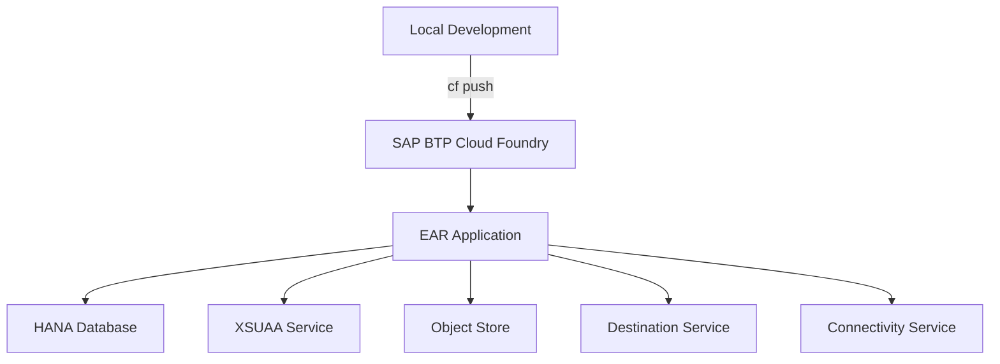

# EAR 배포 가이드

## 1. 배포 개요

EAR 시스템은 SAP BTP (Business Technology Platform) Cloud Foundry 환경에 배포됩니다.

### 1.1 배포 환경

| 환경 | 설명 |
|------|------|
| 개발 환경 | `ear-dev` 애플리케이션 |
| 운영 환경 | `ear-prd` 애플리케이션 |

### 1.2 배포 아키텍처



## 2. 사전 준비사항

### 2.1 필수 도구

- **Cloud Foundry CLI**: SAP BTP에 배포하기 위한 CLI 도구
- **Node.js**: 18.x 이상
- **npm**: 9.0.0 이상

### 2.2 SAP BTP 계정 설정

1. SAP BTP Cockpit 접근
2. Subaccount 및 Space 생성
3. 필요한 서비스 인스턴스 생성

### 2.3 서비스 인스턴스 생성

#### 2.3.1 HANA Database 서비스

```bash
cf create-service hanatrial hdi-shared EAR-PRD
```

#### 2.3.2 XSUAA 서비스

```bash
cf create-service xsuaa application ear-xsuaa -c xs-security.json
```

#### 2.3.3 Object Store 서비스

```bash
cf create-service objectstore s3-standard ear-store
```

#### 2.3.4 Destination Service

```bash
cf create-service destination lite destination-service
```

#### 2.3.5 Connectivity Service

```bash
cf create-service connectivity lite connectivity-service
```

## 3. 환경 변수 설정

### 3.1 필수 환경 변수

**개발 환경** (`manifest-dev.yml`):
```yaml
env:
  NODE_ENV: development
  NODE_VERSION: 22.x
  DB_TYPE: hana
  EMBEDDING_MODEL: text-embedding-3-large
  CHAT_MODEL: gpt-4o-mini
  JWT_SECRET: your-super-secret-jwt-key-min-32-chars
  USE_XSUAA: "true"
  DEFAULT_IDP: "sap.custom"
```

**운영 환경** (`manifest-prd.yml`):
```yaml
env:
  NODE_ENV: production
  NODE_VERSION: 22.x
  DB_TYPE: hana
  EMBEDDING_MODEL: text-embedding-3-large
  CHAT_MODEL: gpt-4o-mini
  JWT_SECRET: your-super-secret-jwt-key-min-32-chars
  USE_XSUAA: "true"
  DEFAULT_IDP: "sap.custom"
  SCIM_SCOPE: "openid scim.read"
  IAS_BASE_URL: "https://[ias-tenant].accounts.ondemand.com"
  C4C_BASE_URL: "https://[c4c-instance].crm.cloud.sap"
  SKN_RAG_URL: "https://[skn-rag-url]"
  ADOTBIZ_PRIVATE_LINK_IP: "10.220.5.115"
```

### 3.2 환경 변수 설정 방법

#### Cloud Foundry CLI 사용

```bash
# 개발 환경
cf set-env ear-dev OPENAI_API_KEY "sk-..."
cf set-env ear-dev JWT_SECRET "your-secret-key"

# 운영 환경
cf set-env ear-prd OPENAI_API_KEY "sk-..."
cf set-env ear-prd JWT_SECRET "your-secret-key"
```

#### manifest.yml 파일 사용

환경 변수는 `manifest-dev.yml` 또는 `manifest-prd.yml` 파일에 정의할 수 있습니다.

## 4. 빌드 및 배포

### 4.1 로컬 빌드

```bash
# 의존성 설치
npm install

# 프론트엔드 빌드
cd web
npm install
npm run build
cd ..

# 백엔드 빌드
cd server
npm install
npm run build
cd ..
```

### 4.2 Cloud Foundry 배포

#### 4.2.1 개발 환경 배포

```bash
# 로그인
cf login -a https://api.cf.[region].hana.ondemand.com

# Space 선택
cf target -o [org] -s [space]

# 배포
cf push -f manifest-dev.yml
```

#### 4.2.2 운영 환경 배포

```bash
# 로그인
cf login -a https://api.cf.[region].hana.ondemand.com

# Space 선택
cf target -o [org] -s [space]

# 배포
cf push -f manifest-prd.yml
```

### 4.3 배포 확인

```bash
# 애플리케이션 상태 확인
cf apps

# 로그 확인
cf logs ear-prd --recent

# Health Check
curl https://[app-url]/health
```

## 5. 데이터베이스 초기화

### 5.1 스키마 생성

HANA Database에 스키마를 생성합니다:

```sql
CREATE SCHEMA EAR;
```

### 5.2 테이블 생성

`server/schemas-hana.sql` 파일을 실행하여 테이블을 생성합니다:

```bash
# HANA Studio 또는 DBeaver에서 실행
# 또는 cf tunnel을 사용하여 로컬에서 연결
```

### 5.3 초기 데이터 삽입

```sql
-- 관리자 사용자 생성
INSERT INTO EAR.users (USERID, PASSWORD_HASH, FULL_NAME, IS_ADMIN, IS_ACTIVE)
VALUES ('admin', '[bcrypt-hash]', 'Administrator', true, true);

-- 기본 메뉴 데이터
-- server/db-hana.ts의 initializeMenus() 함수 실행
```

## 6. XSUAA 및 IAS 설정

### 6.1 XSUAA 서비스 인스턴스 생성

```bash
cf create-service xsuaa application ear-xsuaa -c xs-security.json
```

### 6.2 xs-security.json 설정

```json
{
  "xsappname": "ear",
  "tenant-mode": "dedicated",
  "scopes": [
    {
      "name": "$XSAPPNAME.Admin",
      "description": "Admin scope"
    },
    {
      "name": "$XSAPPNAME.User",
      "description": "User scope"
    }
  ],
  "role-templates": [
    {
      "name": "EAR-ADMIN",
      "description": "EAR Administrator",
      "scope-references": ["$XSAPPNAME.Admin"]
    },
    {
      "name": "EAR-USER",
      "description": "EAR User",
      "scope-references": ["$XSAPPNAME.User"]
    }
  ]
}
```

### 6.3 SAP IAS 설정

1. SAP IAS Tenant 접근
2. 애플리케이션 등록
3. OAuth2 설정
4. XSUAA와 Trust 설정

자세한 내용은 `prompt/README-XSUAA-IAS-설정가이드.md` 참조

## 7. Custom Domain 설정

### 7.1 Domain 생성

```bash
cf create-domain [org] [domain-name]
```

### 7.2 Route 생성

```bash
cf create-route [space] [domain-name] --hostname [hostname]
```

### 7.3 Route 매핑

```bash
cf map-route ear-prd [domain-name] --hostname [hostname]
```

자세한 내용은 `prompt/README-Custom-Domain-설정가이드.md` 참조

## 8. Object Store 설정

### 8.1 서비스 키 생성

```bash
cf create-service-key ear-store ear-store-key
cf service-key ear-store ear-store-key
```

### 8.2 환경 변수 설정

서비스 키 정보를 환경 변수로 설정:

```bash
cf set-env ear-prd OBJECT_STORE_ACCESS_KEY_ID "[access-key]"
cf set-env ear-prd OBJECT_STORE_SECRET_ACCESS_KEY "[secret-key]"
cf set-env ear-prd OBJECT_STORE_BUCKET "[bucket-name]"
cf set-env ear-prd OBJECT_STORE_HOST "[host]"
cf set-env ear-prd OBJECT_STORE_REGION "[region]"
```

## 9. 배포 후 확인사항

### 9.1 애플리케이션 상태

- [ ] 애플리케이션이 정상적으로 시작되었는지 확인
- [ ] Health Check 엔드포인트 응답 확인
- [ ] 로그에 에러가 없는지 확인

### 9.2 데이터베이스 연결

- [ ] 데이터베이스 연결 성공 확인
- [ ] 테이블 생성 확인
- [ ] 초기 데이터 삽입 확인

### 9.3 인증 및 권한

- [ ] 로그인 기능 동작 확인
- [ ] XSUAA 인증 동작 확인
- [ ] 권한별 메뉴 접근 확인

### 9.4 기능 테스트

- [ ] 채팅 기능 테스트
- [ ] 요청 등록 기능 테스트
- [ ] 문서 업로드 기능 테스트
- [ ] RAG 검색 기능 테스트

## 10. 롤백 절차

### 10.1 이전 버전으로 롤백

```bash
# 이전 버전 확인
cf revisions ear-prd

# 특정 버전으로 롤백
cf rollback ear-prd [revision-number]
```

### 10.2 데이터베이스 롤백

필요한 경우 마이그레이션을 롤백:

```sql
-- 롤백 SQL 실행
-- server/migrations/ 디렉토리의 롤백 스크립트 참조
```

## 11. 모니터링 및 로그

### 11.1 로그 확인

```bash
# 실시간 로그
cf logs ear-prd

# 최근 로그
cf logs ear-prd --recent

# 특정 시간대 로그
cf logs ear-prd --recent | grep "2025-01-01"
```

### 11.2 애플리케이션 메트릭

```bash
# 애플리케이션 상태
cf app ear-prd

# 인스턴스 상태
cf app ear-prd --guid | xargs cf curl /v2/apps/$(cf app ear-prd --guid)/stats
```

## 12. 트러블슈팅

### 12.1 일반적인 문제

#### 애플리케이션 시작 실패

```bash
# 로그 확인
cf logs ear-prd --recent

# 환경 변수 확인
cf env ear-prd

# 서비스 바인딩 확인
cf services
```

#### 데이터베이스 연결 실패

- 서비스 인스턴스가 생성되었는지 확인
- 서비스 바인딩이 되어 있는지 확인
- 환경 변수 `DB_TYPE`이 올바른지 확인

#### 인증 실패

- XSUAA 서비스 인스턴스 확인
- xs-security.json 설정 확인
- IAS Trust 설정 확인

### 12.2 자주 발생하는 에러

**"Application failed to start"**
- 로그를 확인하여 구체적인 에러 메시지 확인
- 환경 변수 설정 확인
- 의존성 설치 확인

**"Database connection failed"**
- 서비스 인스턴스 상태 확인
- VCAP_SERVICES 환경 변수 확인
- 네트워크 연결 확인

**"XSUAA authentication failed"**
- xs-security.json 설정 확인
- 서비스 바인딩 확인
- 토큰 검증 로직 확인

## 13. 배포 체크리스트

### 13.1 배포 전

- [ ] 코드 빌드 성공 확인
- [ ] 로컬 테스트 완료
- [ ] 환경 변수 설정 확인
- [ ] 서비스 인스턴스 생성 확인
- [ ] 데이터베이스 스키마 준비

### 13.2 배포 중

- [ ] 빌드 프로세스 모니터링
- [ ] 배포 로그 확인
- [ ] 에러 발생 시 즉시 중단

### 13.3 배포 후

- [ ] 애플리케이션 상태 확인
- [ ] Health Check 확인
- [ ] 기능 테스트 수행
- [ ] 로그 모니터링
- [ ] 성능 확인

## 14. 참고 문서

- `prompt/README-BTP배포가이드.md`: 상세 배포 가이드
- `prompt/README-빠른배포.md`: 빠른 배포 가이드
- `prompt/README-배포체크리스트.md`: 배포 체크리스트
- `prompt/README-XSUAA-IAS-설정가이드.md`: 인증 설정 가이드
- `prompt/README-Custom-Domain-설정가이드.md`: 도메인 설정 가이드


