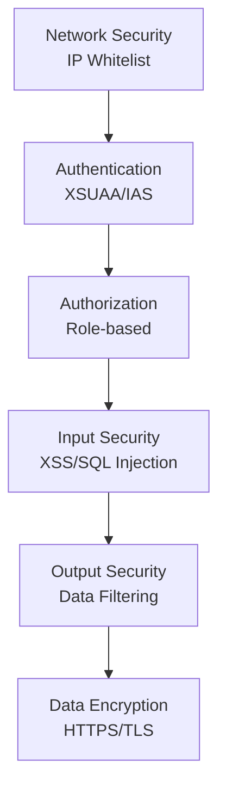

# EAR 보안 가이드

## 1. 보안 개요

EAR 시스템은 다층 보안 아키텍처를 통해 데이터와 시스템을 보호합니다.

### 1.1 보안 계층

## 2. 인증 및 인가

### 2.1 인증 방식

#### 2.1.1 JWT 기반 인증

- **토큰 발급**: 로그인 시 JWT 토큰 발급
- **토큰 검증**: 모든 API 요청 시 토큰 검증
- **토큰 만료**: 설정된 시간 후 자동 만료

#### 2.1.2 XSUAA 기반 인증

- **SAP BTP 통합**: XSUAA 서비스를 통한 인증
- **IAS 연동**: SAP Identity Authentication Service와 연동
- **OAuth2 프로토콜**: 표준 OAuth2 프로토콜 사용

### 2.2 인가 (권한 관리)

#### 2.2.1 역할 기반 접근 제어 (RBAC)

**권한 레벨**:
- **EAR-ADMIN**: 시스템 관리자 권한
  - 모든 기능 접근 가능
  - 사용자 관리
  - 시스템 설정 관리
- **EAR-USER**: 일반 사용자 권한
  - 기본 기능 접근
  - 본인 데이터만 조회/수정

#### 2.2.2 메뉴별 권한 제어

- 메뉴별 접근 권한 설정
- 그룹별 메뉴 매핑
- 동적 메뉴 로딩

## 3. 네트워크 보안

### 3.1 IP 화이트리스트

**기능**: 허용된 IP 주소만 시스템에 접근 가능

**설정 방법**:
1. 시스템 관리 > IP 화이트리스트 관리 메뉴 접근
2. IP 주소 등록
3. 활성화 설정

**제한 사항**:
- IP 주소 또는 IP 범위 설정 가능
- 활성화/비활성화 토글 가능
- 접근 로그 기록

### 3.2 HTTPS/TLS

- 모든 통신은 HTTPS 사용
- TLS 1.2 이상 사용
- 인증서 검증

## 4. 입력 보안

### 4.1 XSS (Cross-Site Scripting) 방지

**대응 방안**:
- 입력 데이터 검증 및 필터링
- HTML 태그 이스케이프
- DOMPurify 라이브러리 사용

**구현 위치**:
- `server/utils/inputValidation.ts`
- `web/src/utils/htmlSanitizer.ts`

### 4.2 SQL Injection 방지

**대응 방안**:
- 파라미터화된 쿼리 사용
- ORM 사용 (직접 SQL 최소화)
- 입력 데이터 검증

**구현 위치**:
- `server/db.ts`: 모든 쿼리는 파라미터화
- `server/utils/inputValidation.ts`: 입력 검증

### 4.3 CSRF (Cross-Site Request Forgery) 방지

**대응 방안**:
- SameSite Cookie 설정
- CSRF 토큰 검증 (향후 구현 예정)

### 4.4 입력 검증 규칙

**관리 기능**: 시스템 관리 > 입력 보안 관리

**검증 항목**:
- 금지 키워드 목록
- SQL Injection 패턴
- XSS 패턴
- 특수 문자 필터링

## 5. 출력 보안

### 5.1 민감 정보 마스킹

**마스킹 대상**:
- 이메일 주소
- 전화번호
- 주민등록번호 (향후)
- 계좌번호 (향후)

**마스킹 규칙**:
- 이메일: `user***@domain.com`
- 전화번호: `010-****-1234`

### 5.2 출력 필터링

**관리 기능**: 시스템 관리 > 출력 보안 관리

**필터링 규칙**:
- 민감 정보 패턴 감지
- 자동 마스킹 적용
- 사용자별 필터링 규칙

## 6. 데이터 보안

### 6.1 비밀번호 보안

**저장 방식**:
- bcrypt 해싱 (salt rounds: 10)
- 평문 비밀번호 저장 금지

**정책**:
- 최소 길이: 8자
- 복잡도 요구사항 (향후 구현 예정)
- 비밀번호 만료 정책 (향후 구현 예정)

### 6.2 데이터 암호화

**전송 중 암호화**:
- HTTPS/TLS 사용
- 모든 API 통신 암호화

**저장 중 암호화**:
- 데이터베이스 레벨 암호화 (HANA)
- 민감 정보는 추가 암호화 (향후 구현 예정)

### 6.3 데이터 접근 제어

**사용자별 데이터 격리**:
- 채팅 히스토리: 사용자별 분리
- 요청 데이터: 등록자별 조회 제한
- 로그인 이력: 사용자별 조회

## 7. 세션 관리

### 7.1 세션 타임아웃

- JWT 토큰 만료 시간 설정
- 자동 로그아웃 기능
- 세션 갱신 기능

### 7.2 계정 잠금

**잠금 조건**:
- 로그인 실패 횟수: 5회
- 잠금 시간: 30분

**해제 방법**:
- 관리자 수동 해제
- 잠금 시간 경과 후 자동 해제

## 8. 로깅 및 모니터링

### 8.1 보안 로그

**기록 항목**:
- 로그인 시도 (성공/실패)
- IP 주소
- User Agent
- 실패 사유
- 접근 시도

### 8.2 이상 행위 감지

**감지 항목**:
- 반복적인 로그인 실패
- 비정상적인 API 호출 패턴
- 권한 없는 접근 시도

## 9. 외부 API 보안

### 9.1 API 키 관리

**관리 방식**:
- 환경 변수로 저장
- 서비스 바인딩 사용 (BTP)
- RAG Agent 정보는 DB에 암호화 저장 (향후)

### 9.2 외부 API 호출 보안

**보안 조치**:
- HTTPS 사용
- 인증 토큰 검증
- 요청 타임아웃 설정
- 에러 처리 및 로깅

## 10. 파일 업로드 보안

### 10.1 파일 검증

**검증 항목**:
- 파일 확장자 검증
- MIME 타입 검증
- 파일 크기 제한 (100MB)
- 바이러스 스캔 (향후 구현 예정)

### 10.2 파일 저장

**저장 위치**:
- SAP BTP Object Store
- 파일 경로는 DB에 저장
- 직접 파일 시스템 접근 불가

### 10.3 파일 다운로드 보안

- 인증된 사용자만 다운로드 가능
- 파일 접근 권한 검증
- 다운로드 로그 기록

## 11. 보안 설정 관리

### 11.1 입력 보안 규칙 관리

**관리 메뉴**: 시스템 관리 > 입력 보안 관리

**기능**:
- 금지 키워드 등록/수정/삭제
- SQL Injection 패턴 등록
- XSS 패턴 등록
- 규칙 활성화/비활성화

### 11.2 출력 보안 규칙 관리

**관리 메뉴**: 시스템 관리 > 출력 보안 관리

**기능**:
- 민감 정보 패턴 등록
- 마스킹 타입 설정
- 규칙 활성화/비활성화

## 12. 보안 모범 사례

### 12.1 개발 시 주의사항

1. **입력 검증**: 모든 사용자 입력 검증
2. **출력 인코딩**: 모든 출력 데이터 인코딩
3. **에러 메시지**: 상세한 에러 정보 노출 금지
4. **로그 관리**: 민감 정보 로그 기록 금지
5. **의존성 관리**: 보안 취약점이 있는 패키지 사용 금지

### 12.2 운영 시 주의사항

1. **정기 업데이트**: 보안 패치 정기 적용
2. **로그 모니터링**: 이상 행위 정기 확인
3. **접근 권한 검토**: 사용자 권한 정기 검토
4. **백업 관리**: 정기 백업 및 복구 테스트
5. **인증서 관리**: SSL 인증서 만료 관리

## 13. 보안 점검 체크리스트

### 13.1 정기 점검 항목

- [ ] 사용자 권한 검토
- [ ] IP 화이트리스트 검토
- [ ] 보안 로그 검토
- [ ] 비밀번호 정책 준수 확인
- [ ] SSL 인증서 유효성 확인
- [ ] 의존성 보안 취약점 확인
- [ ] 백업 상태 확인

### 13.2 배포 전 점검

- [ ] 환경 변수 보안 확인
- [ ] API 키 노출 여부 확인
- [ ] 데이터베이스 접근 권한 확인
- [ ] 네트워크 보안 설정 확인
- [ ] 로깅 설정 확인

## 14. 보안 사고 대응

### 14.1 사고 대응 절차

1. **사고 발견**: 이상 행위 감지
2. **즉시 조치**: 영향 범위 최소화
3. **원인 분석**: 로그 분석 및 원인 파악
4. **복구 조치**: 시스템 복구 및 보안 강화
5. **사후 조치**: 재발 방지 대책 수립

### 14.2 연락처

- **보안 담당자**: [연락처]
- **시스템 관리자**: [연락처]
- **긴급 연락처**: [연락처]

## 15. 참고 문서

- `prompt/README-XSUAA-IAS-설정가이드.md`: 인증 설정 가이드
- `prompt/XSS-TEST-GUIDE.md`: XSS 테스트 가이드
- `server/middleware/auth.ts`: 인증 미들웨어
- `server/middleware/ipWhitelist.ts`: IP 화이트리스트 미들웨어

